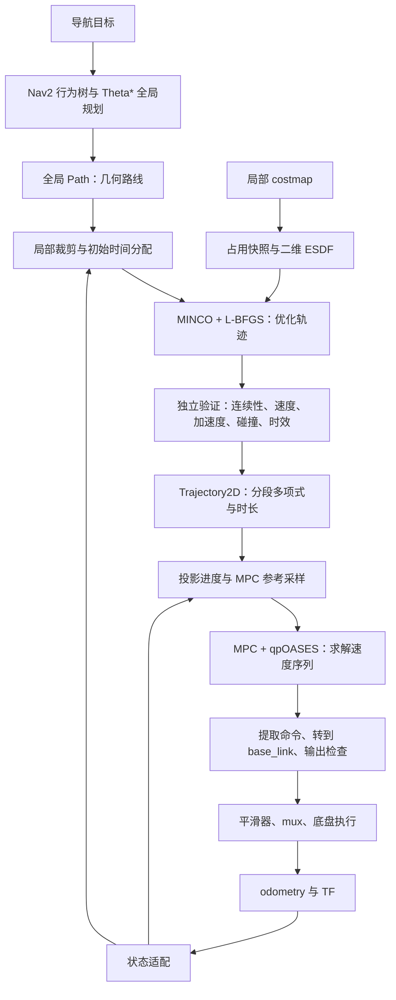

# MINCO + MPC 局部规划器与控制器：结合本仓库，从零学到能读代码

> 核查日期：2026-10-07。依据是**当前工作区源码与 YAML，包含尚未提交的修改**。
> 本文面向第一次接触机器人导航的读者。公式可以分两遍读：第一遍理解每一项在做什么，第二遍再对照代码。
> 本文是源码讲解与操作指南。本次编写没有重新运行 Gazebo、实车或算法测试；历史运行现象会明确引用实施记录，不能视为本次验证结果。

你要先记住一句话：**MINCO 设计未来怎么走，MPC 根据现在实际走到哪里，计算这一刻该给底盘什么速度。**

这里的 MINCO 和 MPC 都装在 `srm27_minco_controller::MincoMpcController` 这个 Nav2 插件里。名字叫 Controller，但它内部同时包含局部轨迹规划与轨迹跟踪。

## 阅读路线

第一次读，按 1 → 2 → 3 → 4 → 5 → 8 → 11 的顺序，先建立整体认识。第二遍读 6、7、9、10，理解数学和实现。准备调试时直接查 12～16；想继续改代码，再读 17、18。

1. [用一个绕箱子的例子认识整套系统](#lesson-1)
2. [先认识十几个常用词](#lesson-2)
3. [你的代码到底已经做到哪一步](#lesson-3)
4. [坐标系、速度和时间](#lesson-4)
5. [ESDF：告诉规划器离障碍有多远](#lesson-5)
6. [MINCO：把折线变成带时间的平滑轨迹](#lesson-6)
7. [优化成功以后，为什么还要验证](#lesson-7)
8. [MPC：看着未来，纠正眼前](#lesson-8)
9. [MPC 的公式怎样对应代码](#lesson-9)
10. [投影进度、命令前瞻和双次 MPC](#lesson-10)
11. [一次控制周期与后台规划线程](#lesson-11)
12. [参数表：每个旋钮在改变什么](#lesson-12)
13. [从编译到观察仿真](#lesson-13)
14. [车不走、来回走、跟不上时怎么查](#lesson-14)
15. [按顺序做六个学习实验](#lesson-15)
16. [源码与测试阅读地图](#lesson-16)
17. [现有实现的边界和容易读错的地方](#lesson-17)
18. [自测：能回答这些问题就抓住了主线](#lesson-18)

<a id="lesson-1"></a>

## 1. 用一个绕箱子的例子认识整套系统

假设小车在房间左边，目标在右边，中间有一个箱子。

**全局规划**先决定从箱子哪一侧过去。你的工程保留 Nav2 的 Theta* 全局规划器，它交给下游一条 `nav_msgs/Path`：可以理解为“沿着这些位置走”。

但折线路径没有充分说明小车如何起步、转弯需要多久、靠近目标如何减速。**局部规划**从这条路径中截取附近一段，结合当前速度与周围障碍，用 MINCO 生成可以随时间求值的曲线。

真实车可能打滑、命令可能延迟，里程计还可能有误差。**MPC 控制**因此不断读取实际状态，预测后续运动，重新选择一串速度，并从中提取当前要执行的速度。

最终还要由下游平滑、仲裁、限幅和底盘执行链处理，车才真正运动。



用三句话分清职责：

- **全局路径**：从箱子左边还是右边走。
- **MINCO 轨迹**：接下来怎样平滑地加速、绕行、减速。
- **MPC 命令**：车现在偏了一点，这一拍该向前和向侧面各走多快。

MPC 不能代替地图，MINCO 也不能替代真实状态反馈。当前 MPC 的 QP 没有直接加入障碍约束，避障主要由 MINCO 与独立验证负责；所以“参考轨迹安全”和“真实车始终安全”还隔着跟踪误差、延迟、定位误差等环节。

<a id="lesson-2"></a>

## 2. 先认识十几个常用词

| 词 | 白话解释 | 在本工程中是什么 |
|---|---|---|
| ROS 2 节点 | 一个有特定职责的软件模块 | `controller_server`、`srm_cmd_mux` |
| Topic / 话题 | 模块之间传送连续消息的通道 | `odometry`、`cmd_vel_nav` |
| Action | 可以持续执行、反馈进度、被取消的任务接口 | 导航到某个目标 |
| Nav2 | ROS 2 的导航框架 | 管理规划、控制、恢复等流程 |
| 插件 | 被框架加载的一段实现 | `MincoMpcController` |
| `FollowPath` | 本配置给控制器起的插件 ID | 参数前缀也是 `FollowPath.*` |
| Path / 路径 | 一串位置，描述从哪里经过 | Theta* 的输出 |
| Trajectory / 轨迹 | 位置随时间的函数，可求速度和加速度 | `Trajectory2D` |
| odometry / 里程计 | 估计车的位置、朝向和运动速度 | `StateAdapter` 的主要输入 |
| TF | 坐标系之间的变换关系 | `map → odom → base_link` |
| costmap / 代价地图 | 每个格子有通行代价的二维地图 | Nav2 的局部地图 |
| ESDF | 每个位置到障碍的带符号距离场 | 优化器查询距离及梯度 |
| yaw / 航向角 | 从上往下看，车头的朝向 | 常写作 ψ，单位 rad |
| 优化 | 在许多候选方案里，找到评分更低的方案 | MINCO 外层优化、MPC 的 QP |
| 约束 | 不能超过的范围，或超过后要受罚的范围 | 速度、加速度、障碍距离 |
| 热启动 | 借用上一轮结果，让下一轮更快 | 轨迹初值复用、QP 求解器复用 |

还要熟悉四个量：

| 量 | 符号 | 单位 | 含义 |
|---|---|---|---|
| 位置 | p | m | 车在哪里 |
| 速度 | v | m/s | 位置变化有多快 |
| 加速度 | a | m/s² | 速度变化有多快 |
| jerk，加加速度 | j | m/s³ | 加速度变化有多快 |

可以想象坐公交：持续匀速时速度不小，但加速度接近零；突然猛踩油门时加速度快速变化，jerk 就大。轨迹惩罚 jerk，是希望加减速更平顺。

`p = [x, y]` 表示把 x、y 两个数放在一起。`‖v‖ = sqrt(vx² + vy²)` 表示合速度，也就是速度箭头的长度。

例如 `vx = 0.3`、`vy = 0.4` 时，合速度是 `0.5 m/s`，不是 `0.7 m/s`。

<a id="lesson-3"></a>

## 3. 你的代码到底已经做到哪一步

### 3.1 先分清三份历史文档

- [早期迁移讨论](局部规划器迁移MINCO_MPC方案%28ai%29.md)：有较早的架构设想与假设。
- [详细迁移实施方案](迁移minco实施方案%28ai%29.md)：说明目标架构、阶段与验收要求。
- [迁移实施记录](minco迁移实施记录%28ai%29.md)：记录落地、修复和运行排查过程。

阅读优先级是：**实际加载的配置 + 实际调用的代码 → 实施记录 → 设计方案**。实施记录也有时间跨度：开头及末尾仍保留“未跑仿真”的文字，中间 §6 已有多次仿真排查记录，不能把全文当成同一时刻的状态快照。

### 3.2 当前实现与计划的对应关系

| 模块 | 当前代码 / 配置 | 应怎样理解 |
|---|---|---|
| 全局规划 | Nav2 Theta* | 保留全局路径来源 |
| 局部前端 | 裁剪全局路径、清洗、重采样、分配时间 | **还没有局部 JPS 搜索** |
| 距离场 | costmap 快照 → 二维 EDT → 双线性插值 | 没有采用早期文档要求的二次插值 |
| MINCO | `MINCO_S3NU`，二维五次轨迹，L-BFGS | 已有完整调用链 |
| 两阶段优化 | PRE + FINELY 开启 | 不等于报告里的所有启发式都开启 |
| 报告式 FINELY 启发式 | 有代码，默认关闭 | 不能当成已验收的窄通道方案 |
| 轨迹验证 | 连续性、极值、碰撞、覆盖时间、时效 | 候选轨迹必须通过后才能提交 |
| MPC | 默认 `velocity_integrator` | 优化输入是速度，没有直接控制轮子力矩 |
| 双次参考 / 双次 QP | 有代码，`two_pass_reference: False` | 当前正常配置只求解一次 |
| 航向 | `yaw_policy.mode: xy_only` | MPC 的角速度权限被设为零 |
| 独立自转 | 仿真 mux 使用 `rotation_velocity.angular.z` | 导航输出的角速度会被 mux 丢弃 |
| 部分轨迹拼接 | 有相关类型/字段 | 当前 worker 没有保留旧前缀的拼接求解 |
| 动态障碍 | 地图占用变化后重规划 | 不含障碍物未来运动预测 |
| 实车迁移 | 有 MINCO YAML | 不能据此认定真实底盘执行链已接通 |

两个数值尤其容易读错：早期方案写的是 **0.5 m/s 起测、测试上限 1.0 m/s**；当前仿真 MINCO YAML 的 `max_linear_speed` 是 **1.5 m/s**（2026-10-09 曾提到 3.0 m/s，当天又撤销：3.0 m/s 下切内弯的横向偏移量超过行为树 `RemovePassedGoals radius=0.35`，途经点删不掉会让车在途径点之间来回跑；改这一项时必须同步 `velocity_smoother` 上下界与 `srm_cmd_mux` 的 `vx_max/vy_max/v_max`），`max_linear_accel` 仍是 **3.0 m/s²**。本文解释当前数值，不把它们当作实车已辨识能力；实车链路同样是 smoother 1.5 m/s。

### 3.3 四个包各管什么

```text
srm27_minco_controller    ROS/Nav2 接口、线程、诊断、速度输出
          ↓
srm27_minco_core          ESDF、轨迹、优化、验证、MPC、重规划
          ↓
srm27_minco_vendor        GCOPTER 的 MINCO / L-BFGS 等数学实现
srm27_qpoases_vendor      qpOASES 二次规划求解器
```

`core` 不依赖 ROS，便于独立测试数学；`controller` 负责把真实消息翻译成算法能用的数据。MINCO 和 qpOASES 是不同的东西：前者用于构造轨迹，后者用于求 MPC 的 QP。

<a id="lesson-4"></a>

## 4. 坐标系、速度和时间

### 4.1 为什么要有 map、odom、base_link

| 坐标系 | 可以怎样想 | 主要用途 |
|---|---|---|
| `map` | 整个场地的地图坐标 | 全局目标与全局路径 |
| `odom` | 短时间内连续的局部坐标 | MINCO 与 MPC 的位置、平移速度 |
| `base_link` | 固定在车身上的坐标 | 底盘最终接收的速度分量 |

定位重匹配可能修正 `map → odom`。若直接用会跳变的全局坐标做局部控制，控制器可能把坐标修正误认为车瞬间移动。当前插件选择 `planning_frame: odom`，并在控制周期中转换全局路径。

机器人车头转过 90° 后，车的“前方”也转了，但场地里的“向东”没有转。全向底盘可以一边朝北，一边向东移动，**运动方向和车头方向可以不同**。

### 4.2 世界方向的速度怎样变成车身方向的速度

设车头相对 odom 的角度是 ψ，代码使用下面的转换：

```text
vx_body =  cos(ψ) * vx_odom + sin(ψ) * vy_odom
vy_body = -sin(ψ) * vx_odom + cos(ψ) * vy_odom
```

如果车头朝北，即 `ψ = π/2`，希望向 odom 的 +x 方向走 `0.5 m/s`：

```text
v_odom = [0.5, 0]
v_body = [0, -0.5]
```

也就是车向自己的右侧平移。对应 [kinematics.hpp][kinematics] 的 `odomToBodyVelocity()`；反向转换用 `bodyToOdomVelocity()`。

MINCO 计算出的 `vx/vy` 不能不经转换就塞进车体系的 `cmd_vel`。否则车不转时似乎正常，一转头就会走错方向。

### 4.3 里程计里的 pose 和 twist 不是默认在同一个坐标系

ROS `Odometry` 的约定是：

- `pose` 相对 `header.frame_id` 表达；这里通常是 `odom`。
- `twist` 相对 `child_frame_id` 表达；这里预期是 `base_link`。

当前 [StateAdapter][state] 订阅 `odometry`，把车体系速度转到规划系。若 twist 各分量都为零，代码还会尝试用两次位姿差分估计速度：

```text
v ≈ (本次位置 - 上次位置) / 两条消息的采样时间差
```

它会检查超时、重复/倒退时间戳和位姿跳变，做速度低通滤波，再按当前速度把位置外推到控制时刻。这里是简单的状态适配与短时外推，并不是一个额外融合 IMU、轮速的完整状态估计器。

实际插件的 `computeVelocityCommands()` 没有使用 Nav2 传入的 `_pose`、`_velocity` 作为控制状态，而是读取自己的 `StateAdapter`。所以状态不对时，要查插件订阅的 `odometry`。

### 4.4 有三种“时间”，不要混在一起

| 时间 | 例子 | 用途 |
|---|---|---|
| ROS 时间 | 消息采样时间、仿真 `/clock` | 对齐状态、检查轨迹年龄 |
| 单调时钟 | `steady_clock` | 统计求解耗时、检查接收超时 |
| 轨迹内部时间 | `trajectory.positionAt(0.4)` 的 0.4 | 表示沿这条曲线走到哪一段 |

“轨迹总时长 2.6 秒”和“轨迹最大年龄 0.3 秒”不矛盾：前者是曲线描述的运动长度，后者是允许信任这份规划结果多久。控制器不断用新状态和地图替换轨迹。

当前进度主要由车在曲线上的**几何投影**决定，不是简单使用“现在时间减轨迹生成时间”。这点会影响起步，见第 10 节。

<a id="lesson-5"></a>

## 5. ESDF：告诉规划器离障碍有多远

### 5.1 为什么 costmap 还不够

costmap 适合告诉导航“这个格子代价高，尽量别走”。连续轨迹优化还需要更具体的信息：

1. 当前位置离障碍有多少米？
2. 往哪个方向移动，距离会增大？

ESDF 提供 `d(x,y)` 和梯度 `∇d(x,y)`。自由空间里的距离通常为正，障碍内部为负；梯度可以理解为“局部让距离增加最快的箭头”。

例如车在一面竖墙左侧，向左移动能离墙更远，此时距离梯度大致指向左。优化器就能据此把轨迹从墙边推开。

### 5.2 当前工程怎样构建 ESDF

[CostmapAdapter][costmap] 先在 costmap 锁内复制数据，然后释放锁，再处理快照。当前默认映射是：

| costmap 值 | 含义 | 快照处理 |
|---|---|---|
| 254 | 致命障碍 | `kOccupied` |
| 255 | 未知 | `kUnknown` |
| 253 | 内切膨胀障碍 | 当前默认不当原始障碍 |
| 0～252 | 空闲或其他代价 | 当前转换后是 `kFree` |

这意味着 ESDF 分支没有保留所有代价等级。低于 254 的高代价值也不能自动理解为 MINCO 的硬障碍；上游障碍层必须正确标记实际占用。

随后 [Esdf2D::build()][esdf] 做二维欧氏距离变换，即 EDT：分别计算到障碍、到自由区的距离，再组合成带符号距离。未知区域默认也作为障碍种子，因为 `safety.unknown_is_obstacle: True`。

EDT 先沿一个轴、再沿另一个轴处理，避免让每个格子逐个遍历全部障碍。当前局部地图是 `5 m × 5 m`、分辨率 `0.05 m`，也就是约 `100 × 100` 个格子。

自由区域的距离还减去半格对角线，使估计更保守：

```text
半格对角线 = resolution * sqrt(2) / 2
0.05 m 分辨率下约为 0.0354 m
```

查询任意连续位置时，当前使用相邻四个格子的**双线性插值**，并计算这个插值函数的导数。当前代码没有二次插值，也没有独立 ESDF 服务节点。

### 5.3 机器人有体积：距离阈值为什么是 0.38 米

本配置使用圆形包络：

```text
robot_radius       = 0.33 m
clearance_margin   = 0.05 m
要求的中心距离     = 0.33 + 0.05 = 0.38 m
```

ESDF 查的是**轨迹点，也就是车体参考点，到障碍的距离**，没有提前减掉车身半径。诊断字段 `minimum_clearance` 也是这个距离口径，不能直接当成“车壳到墙的剩余空隙”。

例如 `minimum_clearance = 0.50 m`，相对于 0.38 m 阈值，余量约为 `0.12 m`。

不要把已经膨胀出机器人半径的区域再次当成原始障碍，然后再加一遍 0.33 m；这样会重复计算体积，把通道误判得过窄。

### 5.4 ESDF 不保证优化一定成功

距离场在两面墙的对称中间可能没有唯一的增大距离方向；某些插值区域也可能产生平坦梯度。零梯度不必然是错误，但需要用具体场景判断。

此外，地图范围外的查询返回 `valid = false`。优化代价里没有把每次无效查询都变成硬碰撞约束，真正阻止这类轨迹执行的是后续验证器。因此必须检查 `query.valid`，不能只看一个距离数值。

<a id="lesson-6"></a>

## 6. MINCO：把折线变成带时间的平滑轨迹

### 6.1 路径和轨迹最根本的区别

路径可以是：

```text
(0, 0) → (1, 0) → (1, 1)
```

它说要经过三个位置，却没说何时到达。轨迹则可以回答：

```text
0.2 秒时在哪里？速度多大？
0.5 秒时在哪里？加速度多大？
1.0 秒时是否已经开始转弯？
```

用函数表示就是 `p(t)`。位置对时间求一次导数得到速度，再求一次得到加速度，再求一次得到 jerk：

```text
v(t) = p'(t)
a(t) = p''(t)
j(t) = p'''(t)
```

这里“求导”只表示问“这个量此刻变化有多快”。你可以先不学完整微积分，也能理解三者关系。

### 6.2 一段五次多项式是什么

本项目每一段分别保存 x 和 y 两组系数。以 x 为例：

```text
x(τ) = c0 + c1*τ + c2*τ² + c3*τ³ + c4*τ⁴ + c5*τ⁵
0 ≤ τ ≤ T
```

`τ` 是这一段开始后的秒数，`T` 是这一段持续多久，`c0…c5` 是决定曲线形状的六个数。y 方向完全相同。

求导后：

```text
vx(τ) = c1 + 2*c2*τ + 3*c3*τ² + 4*c4*τ³ + 5*c5*τ⁴
ax(τ) = 2*c2 + 6*c3*τ + 12*c4*τ² + 20*c5*τ³
jx(τ) = 6*c3 + 24*c4*τ + 60*c5*τ²
```

这就是 [Trajectory2D][trajectory] 能从同一条曲线一致地求位置、速度和加速度的原因。RViz 上显示的一串点只是对曲线的采样。

一个帮助理解的例子：从 x=0 静止出发，到 x=1 静止停下，起终点加速度也为零，时长为 T，则单段最小 jerk 解可写成：

```text
s = t/T
x(t) = 10*s³ - 15*s⁴ + 6*s⁵
```

当 T=2 s 时，t=1 s 恰好走到 x=0.5 m，此时速度为 0.9375 m/s。这个例子说明：同样走 1 米，给的时间不同，速度和加速度会很不一样。

**例子用了归一化时间 s；实际源码保存的是秒制局部时间 τ 的系数。** 不能在源码里求导之后再随手除一次 T。实施过程中就修复过把这两种表示混淆的问题。

### 6.3 MINCO 在这里的核心作用

MINCO 的核心思想是：用较少的路标点和段时长，决定整条满足边界及平滑要求的多项式轨迹。

你给它：

- 起点的位置、速度、加速度；
- 终点的位置、速度、加速度；
- 中间要经过的路标点；
- 每一段持续的时间。

在这些条件固定时，当前 `MINCO_S3NU` 生成最小化 jerk 平方积分的五次多项式轨迹。内部虽然是三维库，本项目把 z 及其导数固定为零，只使用 x/y。

对于 M 段二维轨迹，直接调整全部多项式系数有 `12M` 个系数。当前外层主要调整 `2(M−1)` 个路标点坐标和 M 个时长参数，共 `3M−2` 个变量，系数由 MINCO 内部解出。

例如 M=6 时，是调整 16 个外层变量，而不是直接摆弄 72 个系数。路标点是轨迹经过点，但**外层优化可以移动内部路标点**，所以最终轨迹不需要逐点穿过原始全局 Path。

MINCO 数学内核本身不知道箱子在哪里。障碍、限速和耗时偏好，是本项目 [MincoOptimizer][optimizer] 在外层增加的。

### 6.4 前端先给一个合理初值

“初值”是优化开始之前的第一份草稿。[PlanningWorker][worker] 和 [TrajectoryInitializer][initializer] 的主线是：

1. 在全局路径中找离车最近的路点。
2. 从当前位置沿路径向前截取，当前视野是 2.0 m。
3. 清除重复点、小抖动，按约 0.10 m 的弧长间隔重采样。
4. 根据转角降低局部速度。
5. 从起点向前检查能否加速到下一点；从终点向后检查能否及时刹住。
6. 估计总时间，再取内部路标点和段时长，当前段数范围是 2～12。

其中一条常见关系是：

```text
v_next² ≤ v_now² + 2*a*距离
```

它来自匀加速运动，表示“距离不够时，下一点的速度不能凭空变大”。后向扫描也是同样道理，只是从停车端往回限制速度。

局部起点的速度来自当前状态，起点加速度目前设为零；最终目标速度设为零。当前 `terminal_speed: 0.0`，局部截断终点也按零速度初始化，后续靠持续重规划把前方轨迹向前更新。

前端目前依赖全局路径给出绕障方向。若新障碍完全挡住局部初值，L-BFGS 未必能自己发现一条全新的绕行路线。这正是后续考虑 JPS 等搜索前端的原因。

### 6.5 优化到底在优化什么

可把总代价 J 理解成“这条轨迹的扣分”。当前主要形式是：

```text
J = w_jerk * ∫‖j(t)‖² dt
  + w_time * 总时长
  + ∫[障碍惩罚 + 超速惩罚 + 超加速度惩罚] dt
  + PRE 阶段的段时长比例惩罚
  + 可选的路标点参考吸引
```

`∫` 表示沿整段时间累计；`w` 是权重，表示重视程度。

| 项 | 偏大的后果 / 倾向 |
|---|---|
| jerk 代价 | 希望动作更平缓，可能宁愿花更长时间 |
| 时间代价 | 希望更快走完，可能向动力学上限靠近 |
| 障碍代价 | 希望保持更大的障碍距离 |
| 超速 / 超加速度代价 | 希望不超过有效运动能力 |
| 时间比例代价 | PRE 中避免某一段过长、另一段过短 |
| 参考吸引 | 希望内部路标点接近初始参考；核心支持，当前插件没有暴露该权重参数，默认关闭 |

障碍项关心的是 `0.38 − d(p)`；速度项关心 `‖v‖² − vmax²`；加速度项关心 `‖a‖² − amax²`。这些量为正，就表示进入了不希望出现的区域。

源码用平滑的 softplus hinge 近似“超过阈值才处罚”：

```text
hinge(h) = log(1 + exp(β*h)) / β
```

实现做了数值稳定处理。你只需要知道：h 很负时罚得少，h 为正时罚得多，β 控制过渡有多陡。

这些是**软约束**：优化器可能为了缩短时间，接受一点超速并支付罚分。调大权重不能替代硬验证。

### 6.6 L-BFGS、梯度、正时长分别解决什么

L-BFGS 是外层的数值优化方法。它不断尝试修改路标点和时长，并根据梯度判断怎样改可能降低代价。

梯度可以理解为“每个变量稍微改一点，扣分会怎样变化”。障碍梯度先从 ESDF 来，随后通过多项式和 MINCO 的 `propogateGrad()` 回传到路标点与时长。

段时长不能为负，所以优化器不直接随意优化 T，而是优化无约束变量 s：

```text
T = Tmin + softplus(s)
```

不管 s 是正是负，得到的 T 都大于 Tmin。这里的 s 是时间参数变量，与前面教学例子里的归一化时间不是同一个变量。

障碍和动力学惩罚通过每段 8 个中点采样近似积分：

```text
J_piece ≈ (T / 8) * Σ L(采样点)
```

调整 T 会同时改变积分权重、采样时刻和由 MINCO 解出的系数。当前源码的时间梯度处理了这些项；旧实施记录中出现的 `∂v/∂T = −v/T` 不能直接套进当前固定秒制系数的求导过程。

进阶读法：在固定系数、采样时刻 `τj = fj*T` 时，`∂p/∂T = fj*v`、`∂v/∂T = fj*a`、`∂a/∂T = fj*j`；系数随 T 变化的间接影响再由 MINCO 回传处理。

### 6.7 PRE 和 FINELY 是什么

当前两阶段都调用 L-BFGS，核心区别是：

- PRE 额外惩罚段时长与平均段时长的比例偏离，当前比例目标区间为 `[0.9, 1.1]`。
- FINELY 继续优化，关闭这项 PRE 比例惩罚；报告式通道梯度启发式只有在单独开关打开时才参与。

比例区间通过罚项实现，并不是一个“绝对夹紧所有时长”的硬约束。`two_stage_optimization: True` 与 `enable_report_fine_heuristic: False` 可以同时成立。

两阶段的目的，是先稳住轨迹和时间分配，再继续改善代价。它们没有把整个非凸问题变成必定找到全局最优的算法。

<a id="lesson-7"></a>

## 7. 优化成功以后，为什么还要验证

可以把优化器看作交设计稿的人，验证器是检查稿件能否执行的人。**“求解器正常结束”只说明得到一个数值结果，不能直接说明不会撞车或超速。**

当前 [TrajectoryValidator][validator] 主要检查：

| 检查 | 为什么需要 |
|---|---|
| 系数与时长合法 | 拒绝 NaN、无穷大、非法有效期等 |
| 段间位置、速度、加速度连续 | 防止接缝突然跳位置或跳速度 |
| 速度与加速度极值 | 避免只检查路标点、漏掉两点之间的峰值 |
| 整条轨迹的碰撞采样 | 平滑曲线可能切进折线拐角内侧的障碍 |
| 覆盖时间 | 轨迹需要覆盖预测窗口与停车需求 |
| 地图和轨迹时效 | 不能无期限执行旧环境下的规划 |
| 最终目标末速 | 最终目标轨迹需要以接近零的速度结束 |

速度极值如何查？五次位置的速度是四次多项式，`‖v(t)‖²` 是至多八次多项式。找到其导数为零的时刻，再加上端点，就能检查峰值；代码还加密采样兜底。

碰撞检查的采样步长同时受时间间隔与空间间距限制，降低跨过薄障碍的风险。它仍是离散地图与采样验证，不等于对连续真实世界的形式化安全证明。

### 7.1 超速候选的时间拉伸

worker 在最终验证前会计算极值。若超限，尝试增大各段时长，当前最多两次：

```text
scale = max(1, 最大速度/vmax, sqrt(最大加速度/amax))
T_new = scale * T_old
```

直观上，把一段运动做慢，速度会降低，加速度也会降低。对于纯时间缩放，速度按 `1/scale`、加速度按 `1/scale²` 缩小。

但这里保留首末 p/v/a 并重新解 MINCO，尤其边界速度非零时，轨迹形状与极值未必严格按上述比例变化。因此修复后还要重新计算极值，并做完整碰撞与时效检查；不能把这一步理解为无条件修好。

### 7.2 覆盖时间的实际公式

当前代码是：

```text
MPC 窗口       = prediction_steps * prediction_dt
停车时间       = reaction_latency + 当前实测速度 / braking_deceleration
要求覆盖时间   = max(MPC 窗口, 停车时间)
```

注意是 **max**，不是相加。错误提示里虽然写着 `MPC window plus stopping time`，实际实现取较大值。

按当前配置，MPC 窗口 `30 × 0.02 = 0.6 s`。假设当前车速是 3.0 m/s，制动减速度取 3.0 m/s²，反应时间取 0.1 s：

```text
停车时间 = 0.1 + 3.0/3.0 = 1.1 s
要求覆盖时间 = max(0.6, 1.1) = 1.1 s
```

如果制动减速度误用 0.3 m/s²，同样速度下就变成 10.1 s，候选轨迹可能大量被拒。**当前公式用状态速度，不是每次固定用 vmax**；静止状态不能也直接代入 3.0。

物理上还可用停车距离帮助理解视野：

```text
d_stop ≈ v * 延迟 + v² / (2 * 制动减速度)
```

它是直线匀减速近似，还需要考虑车身与障碍余量。配置加速度不自动等于实车能够保证的制动能力。

当前验证器检查的是整条候选轨迹，覆盖时间也按整条有效前缀统计；尚未完整实现按当前跟踪进度裁剪后、对“剩余可停车轨迹”的严格验证，见第 17 节。

<a id="lesson-8"></a>

## 8. MPC：看着未来，纠正眼前

MPC 全称 Model Predictive Control，模型预测控制。它每次都做四件事：

1. **测量现在**：车在哪里，朝哪边，速度多大。
2. **预测未来**：如果接下来给这些速度，车会到哪里。
3. **比较方案**：谁跟参考更近、速度变化更合理、满足约束。
4. **执行并重算**：提取一条当前命令，下一周期用新状态重新优化。

可以想象你端着一杯水走路：既看脚下偏了多少，也看前面是不是要拐弯，再决定下一步怎么迈。

### 8.1 为什么有 MINCO 还需要 MPC

MINCO 的轨迹可能要求 t=0.4 秒时到达某点，但真实车因延迟只到了一半。直接播放规划速度，没有机制把偏差拉回来。

MPC 把真实状态作为新的预测起点。假设参考在车的左前方，它可以同时给出前向与横向速度，逐渐减小误差。全向底盘允许横移，这是本项目模型保留 `vx`、`vy` 两个独立分量的原因。

### 8.2 当前模型有多简单

默认模型是速度积分器：

```text
状态 z = [x, y, ψ]
输入 u = [vx, vy, ω]

x_next = x + h*vx
y_next = y + h*vy
ψ_next = ψ + h*ω
```

`h` 是预测步长，当前是 0.02 秒。所有平移量都在 odom 系，所以 x/y 的预测不用随着车头方向再旋转一遍。

例如 x=1.00 m，预测输入 vx=0.5 m/s，0.02 秒后预测 x=1.01 m。

模型相当于假设底盘能较快跟上速度指令，再通过输入变化约束限制加减速。它没有显式描述轮胎打滑、电机电流、底盘质量和惯量；误差较大时需要辨识与改进，不能靠“用了 MPC”自动解决。

### 8.3 一次看多远，多快重算

当前配置：

```text
controller_frequency = 50 Hz  → 目标控制周期 20 ms
prediction_dt        = 0.02 s
prediction_steps     = 30     → 预测窗口 0.6 s
```

求解器一轮优化 30 组 `[vx, vy, ω]`，合起来是 90 个决策变量。它不会等 0.6 秒全部执行完才反馈；约每 0.02 秒就重新求解。

“预测步长”和“实际控制间隔”是不同概念。这份配置恰好都约 0.02 秒，代码仍然单独计算真实控制间隔，供首步输入变化约束使用。

mux 的 200 Hz 是转发/合成频率，不能当成 MPC 求解频率。

<a id="lesson-9"></a>

## 9. MPC 的公式怎样对应代码

这一节可以第二遍再读。先看每个式子旁边的白话说明。

### 9.1 把 30 步预测写成一条式子

[MpcModel][model] 用矩阵表达单步运动：

```text
z(k+1) = A*z(k) + B*u(k)
```

速度模型中 `A = I`，`B = hI`。I 是单位矩阵，作用类似普通数字里的 1。

把所有未来输入堆成一个长向量 U，把未来状态堆成 Z，就得到：

```text
Z = Sx*z0 + Su*U
```

- `z0`：实际车的当前状态。
- `Sx*z0`：初始状态对未来的影响。
- `Su*U`：各步命令累积后对未来的影响。

这就是“凝聚”：用 U 一个未知向量表达整条预测轨迹，求解器不必把每一步状态都当成独立未知量。

### 9.2 MPC 的扣分规则

[MpcSolver::solve()][solver] 使用：

```text
J = (Z - Zref)ᵀ Qbar (Z - Zref)
  + (U - Uref)ᵀ Rbar (U - Uref)
  + (D*U - d_prev)ᵀ Sbar (D*U - d_prev)
```

`ᵀ` 是转置符号。`eᵀQe` 可以先当成“把各方向误差平方后，乘权重再相加”。

| 项 | 惩罚什么 | 对应配置 |
|---|---|---|
| 状态误差 | 预测位置离参考位置多远 | `q_position` 等 |
| 输入误差 | 计划给出的速度离轨迹速度多远 | `r_translation`、`r_angular` |
| 输入变化 | 相邻命令变化有多大 | `r_input_change` |

一个常见误解：这里 R 惩罚的是 **U 与 Uref 的差**，不是单纯惩罚速度大小。加大 `r_translation` 的直接作用是更重视参考速度，不能简单解释为“车一定更慢”。

当前 `r_input_change: 0.0` 表示关闭变化量的**软惩罚**；`enforce_input_change: True` 仍然开启变化量的**硬约束**。两者作用不同。

### 9.3 为什么叫 QP，qpOASES 在做什么

代入预测式后，目标可整理为：

```text
min  1/2 * Uᵀ*H*U + gᵀ*U
```

再加线性的速度界与变化量界，这类问题叫二次规划，Quadratic Programming，简称 QP。qpOASES 接收 H、g 和约束，返回 U。

当前代码里的矩阵是：

```text
H = 2 * (Suᵀ*Qbar*Su + Rbar + Dᵀ*Sbar*D)
g = 2 * (Suᵀ*Qbar*(Sx*z0 - Zref) - Rbar*Uref - Dᵀ*Sbar*d_prev)
```

如果关闭输入变化惩罚，S 相关项不加入。前面的系数 2 来自求解器目标采用 `1/2 * UᵀHU` 的约定。

你可以把 qpOASES 想成一个专门解这类表格的数学工具。它不了解机器人、地图或者 ROS；数据是否正确、约束是否合理，由调用方负责。

### 9.4 合速度为什么用八边形限制

如果只限制 `|vx| ≤ 1.5`、`|vy| ≤ 1.5`，同时取 1.5 时合速度是约 2.12 m/s，超过预期。

理想限制是圆：

```text
vx² + vy² ≤ vmax²
```

当前 QP 用圆内的正八边形作保守近似：

```text
n_jᵀ * v ≤ vmax * cos(π/K)，K=8
```

`n_j` 是各条边向外的单位法向。这样选出的速度都在允许圆内，但有些方向会损失一点最大速度。

源码使用对称上下界并遍历所有方向，包含等价的重复约束；理解几何意义即可。以当前多边形朝向，纯 x 方向最大值约为 `3.0*cos(π/8) = 2.772 m/s`，所以 MINCO 参考峰值接近 3.0，不表示 MPC 在每个方向都能输出 3.0。

### 9.5 速度变化约束与实际实现差别

速度模型中希望有：

```text
|vx(k) - vx(k-1)| ≤ a_limit * Δt
```

y 和角速度同理。假设 a=3 m/s²、Δt=0.02 s，单轴一拍最多改变 0.06 m/s。首拍应与上一条已执行命令比较，后续拍与前一预测拍比较。

当前 QP 的平移变化约束按 x/y **分量**施加，不是合加速度圆约束。插件输出前又做了一次合速度变化量检查。首次没有上一条命令时，首步变化界会放宽。

这里还存在值得核查的实现问题：`buildConstraints()` 首步对 `+u0` 使用 `[-limit-base, limit-base]`，对应围绕 `−base` 的区间；若 base 的语义是上一条输入，通常应围绕 `+base`。这与上述“期望约束”不同。本文如实区分公式意图与源码，不把现有首步约束写成已经正确实现的保证；修改前应增加针对非零上一条输入的验证。

### 9.6 横向误差为什么可能比沿途误差重要

在窄通道中，慢一点通常比横向偏到墙上更容易接受。核心支持沿轨迹与垂直轨迹分别加权：

```text
Qxy = q_along * t*tᵀ + q_cross * n*nᵀ
```

t 是沿轨迹的单位方向，n 是垂直它的单位方向。`q_cross > q_along` 表示更在意横向偏离。

当前 `use_tangent_normal_weight: False`。不要只打开这个开关就认为窄通道功能完成：轨迹安全、跟踪误差、车身几何以及求解器热启动的矩阵更新都要配套检查。

### 9.7 热启动与求解时限

当前求解器会保留 qpOASES 实例，下一轮从上一轮的工作集继续求解；失败时尝试冷启动。`activate()` 还会做一次预热。

实施记录给出过热启动显著快于冷启动的测量，但那是具体测试条件下的数据。实际负载下要看 `mpc_solve_time_pass1_ms` 和整个控制周期的耗时。

`qp_deadline_ms: 5.0` 当前是**事后性能门槛**：求解成功但超过 5 ms 时，记录超预算并告警，仍可使用通过检查的解。它不是强制在 5 ms 中断线程的硬实时机制。工作集迭代次数耗尽、不可行、数值错误则会返回求解失败。

<a id="lesson-10"></a>

## 10. 投影进度、命令前瞻和双次 MPC

### 10.1 先找车在轨迹上的哪里

[TrackingReferenceBuilder][reference] 找到轨迹上离车最近的位置，并用该点的轨迹时间表示进度：

```text
progress ≈ 使 ‖p(t) - 当前车位置‖² 最小的 t
```

有历史进度时，只在附近窗口搜索，并限制单周期推进与回退，减少自交轨迹跳到错误分支的风险。提交新轨迹后会重置投影历史。

得到进度后，当前第一次参考采样从 `progress` 开始，以 h 递增：

```text
progress, progress+h, progress+2h, ...
```

分别从 MINCO 读取位置、速度、加速度，再由 yaw policy 补航向参考。速度接近零时，切线方向不可靠，不能用 `atan2(0,0)` 随意制造一个方向。

实现细节：`MpcModel` 堆叠的是未来 `z1…zN`，参考列却从 progress 采样；这是当前代码的索引约定，不能在推导中偷偷改成从 `progress+h` 开始。

### 10.2 起步为什么可能卡住

在当前这种参考采样、代价和速度模型组合下，静止起步可能出现：

```text
MINCO 起点速度为零
       ↓
MPC 认为这一拍少动，把加速安排在后面更划算
       ↓
实际车几乎没动
       ↓
下一轮投影仍在起点
       ↓
又求出“这一拍少动”的方案
```

这能解释“预测里后面明明有速度，车却不启动”。它是特定配置下的闭环行为，**不是所有速度层 MPC 都必然自锁**。

[实施记录 §6.4](minco迁移实施记录%28ai%29.md) 记录过该问题，并新增 [test_mpc_startup.cpp][startup-test] 对这一组合做回归测试。

### 10.3 当前命令前瞻是怎么取的

当前 `mpc.command_lookahead: 0.20`。速度模型中 `commandAt()` 按预测输入序列取值：

```text
lookahead / prediction_dt = 0.20 / 0.02 = 10
取从 0 编号的 u[10]，即第 11 个预测输入
```

若落在两拍之间，则线性插值。例如 0.21 秒介于 u[10] 与 u[11] 之间，按比例混合；超出范围会夹到边界。

所以本实现不是教科书里严格的“永远只执行第一个输入”。它通过前瞻选取较后的速度，以改变起步和执行时序。

**0.20 秒不能被解释为已经测得系统延迟就是 200 ms。** 实施记录中的这个值用于处理特定仿真起步问题。实车上需要重新核对延迟、模型、参考索引、输出限幅与稳定性；把前瞻越调越大可能过冲或破坏预测与执行的一致性。

当前世界速度转车体速度时，yaw 从预测状态离散列取出，没有与速度一起做连续时间插值。在独立自转模式下，模型也没有把外部自转输入完整纳入未来 yaw 预测，因此“按执行时刻朝向补偿”仍有边界。

### 10.4 双次 MPC 的思路

当前代码有这条分支，但 YAML 默认关闭：

1. 正常构造参考，解第一次 QP。
2. 比较预测速度与轨迹参考速度的方向。
3. 方向差得多时，减慢沿参考轨迹向前取样的进度。
4. 用新参考再解一次 QP；第二次失败时保留第一次有效解。

关键公式是：

```text
alpha = clamp(cos(预测速度与参考速度夹角), 0, 1)
tau_next = tau_now + h*alpha
```

夹角越大，参考前进越慢，让控制器有机会优先纠正偏离。速度接近零时方向不可靠，当前取 `alpha=1`，避免停在原地。

变小的是**参考曲线上的采样时间增量**；MPC 物理模型的步长 h 仍然不变。不要把它理解为控制器变慢运行。

<a id="lesson-11"></a>

## 11. 一次控制周期与后台规划线程

### 11.1 从哪两个函数开始读

先读 [minco_mpc_controller.cpp][controller] 的 `computeVelocityCommands()`，再读 [planning_worker.cpp][worker] 的 `plan()`。前者是每次要速度时的主线，后者是规划一条候选轨迹的主线。

下面是对当前控制流程的教学化压缩，不是可以直接编译的代码：

```text
computeVelocityCommands():
    读取并检查当前里程计状态
    若定位跳变，作废旧轨迹
    将全局 Path 转到 odom
    复制 costmap，在控制线程中构建 ESDF
    收取后台结果，检查目标/路径/限速版本及有效期
    必要时，在最新地图上复验当前轨迹
    根据重规划策略提交任务
    若无有效轨迹，返回零速度；持续失败后抛异常
    根据投影进度采样 MPC 参考
    求解 QP，可选第二次参考与求解
    提取前瞻速度，转到 base_link，做输出检查
    返回 TwistStamped，发布诊断和可视化
```

后台线程的流程是：

```text
PlanningWorker::plan():
    截取局部路径
    构造路标点和初始时长
    MINCO PRE / FINELY 优化
    必要时尝试时间拉伸
    独立验证
    添加版本、有效期、距离采样
    把结果交回控制线程
```

后台线程不会自己发布速度。Nav2 controller_server 通过插件返回值获得速度，速度出口因此集中在控制调用链上。

### 11.2 为什么不每拍都同步等待 MINCO

优化耗时会变化。如果 50 Hz 的控制线程每一拍都等待完整规划，某次规划变慢就会拖住速度更新。

所以 worker 在后台处理候选轨迹；当前轨迹有效时，控制线程可以继续跟踪。待处理请求槽只保留最新一份，已开始执行的旧计算并不是立即被强制打断。

`replan_frequency: 10.0` 是周期重规划策略的配置，不代表 worker 自己有一个精确 10 Hz 定时器。没有轨迹、目标/路径变化等事件可以更早触发请求。

注意：当前 ESDF 在 `refreshMap()` 内构建，仍占用控制线程时间。不能根据“有后台线程”就判断所有较重操作都已经异步化。

### 11.3 为什么需要四个版本号

假设后台正在计算去 A 点的轨迹，用户突然改去 B 点。A 的结果晚一点出来，如果没有检查，就可能让车继续去 A。

| 字段 | 表示什么 |
|---|---|
| `goal_epoch` | 当前目标会话编号 |
| `path_version` | 当前全局路径版本 |
| `map_version` | 地图内容版本 |
| `limits_version` | 当前限速版本 |

当前 `setPlan()` 用终点位置变化超过约 1 mm 或路径坐标系变化等条件判断新目标；同一终点的刷新也会递增 `path_version`，但保留现有轨迹与控制历史。

收取结果时严格核对当前 goal/path/limits；地图版本没有简单要求与当前值绝对相等，而是结合后续最新地图复验。不能把结构体注释里的“任何版本变化全部作废”当成全部运行行为。

轨迹用只读 `shared_ptr` 快照交换。你可以把它理解成“一次交接整份已经写完的计划”，控制线程不会边读，后台边修改同一份轨迹。

### 11.4 失败、停车与恢复

当前失败分支先返回零速度，默认允许 `build_grace_period = 1.0 s` 的建轨宽限；持续失败超过宽限，抛出异常交给 Nav2 上层处理。Nav2 还有自己的 `failure_tolerance`、进度检查与行为树恢复逻辑。

**返回零速度不是证明实体车已经停稳。** 当前 `stopCommand()` 不是一条经过优化的制动轨迹，真实停车过程仍由下游平滑器、底盘内环和物理能力决定。

仿真执行链是：

```text
FollowPath 插件返回速度
  → controller_server
  → cmd_vel_controller → velocity_smoother → cmd_vel_nav
    （关闭 smoother 时，controller 直接输出 cmd_vel_nav）
  → srm_cmd_mux：取导航 vx/vy，取独立 rotation_velocity 的 wz
  → cmd_vel_sim
  → srm_velocity_adapter / Gazebo 执行
```

mux 对导航和自转分别检查超时。导航停止或取消并不自动等于独立自转停止。当前 `StoppedGoalChecker` 还要求角速度低于阈值；独立自转持续运行时，到点判定可能一直不能成功。这也是新手实验应先使用 `rotation_mode=stop` 的原因。

<a id="lesson-12"></a>

## 12. 参数表：每个旋钮在改变什么

以下取自当前 [仿真 MINCO YAML][sim-config]。除 `controller_frequency` 和 goal checker 外，表内插件参数都位于 `controller_server.ros__parameters.FollowPath` 下。

**YAML 值、C++ 默认值、运行值可能不同。** 例如插件声明的默认速度仍为 0.5 m/s，当前 YAML 覆盖为 3.0 m/s；先确认加载了哪份文件。

### 12.1 时间、地图和几何

| 参数 | 当前值 | 意义与调参方向 |
|---|---:|---|
| `controller_frequency` | 50 Hz | Nav2 调用控制器的目标频率 |
| `replan_frequency` | 10 Hz | 周期重规划频率；提高会增加计算压力 |
| `planning_horizon` | 3.0 m | 沿路径向前截取的长度，不是预测秒数；3.0 m/s 下约合 1.0 s |
| `state_timeout` | 0.10 s | 状态最大年龄，也被用作验证器反应时间 |
| `map_timeout` | 0.30 s | 检查 ESDF 快照年龄；不等同传感器新鲜度，见 §17 |
| `trajectory_max_age` | 0.30 s | 候选/执行轨迹的可接受年龄 |
| `build_grace_period` | 1.0 s | 暂时没有轨迹时允许零输出的宽限 |
| `planning_deadline_ms` | 30 ms | 当前只读取和检查参数，没有强制中止规划 |
| `diagnostics_period` | 0.5 s | 诊断约 2 Hz 发布，不代表控制只有 2 Hz |
| `safety.robot_radius` | 0.33 m | 模型包络半径 |
| `safety.clearance_margin` | 0.05 m | 附加距离余量 |
| `safety.unknown_is_obstacle` | True | 未知区域是否当障碍 |
| `safety.braking_deceleration` | 0.0 | 0 表示回退到基础 `max_linear_accel`，不是零制动能力 |

### 12.2 MINCO 与有效约束

| 参数 | 当前值 | 意义 |
|---|---:|---|
| `minco.polynomial_order` | 5 | 当前只支持五次，不是可随意调成七次的旋钮 |
| `minco.w_jerk` | 0.2 | 平顺程度与耗时之间的取舍 |
| `minco.w_time` | 10.0 | 完成得更快的倾向 |
| `minco.w_obstacle` | 100.0 | 障碍距离软惩罚 |
| `minco.w_velocity` | 60.0 | 超速软惩罚 |
| `minco.w_acceleration` | 300.0 | 超加速度软惩罚 |
| `minco.samples_per_piece` | 8 | 每段优化积分点数；不是验证器采样点总数 |
| `minco.resample_step` | 0.10 m | 前端几何重采样距离 |
| `minco.nominal_piece_duration` | 0.30 s | 初值分段的目标时长 |
| `minco.min_pieces / max_pieces` | 2 / 12 | 初值段数范围 |
| `minco.min_piece_duration` | 0.05 s | 正时长参数化中的下限 |
| `minco.max_piece_duration` | 1.00 s | 前端分段等使用的配置；不能理解为所有优化结果的硬上界 |
| `minco.lbfgs_past` | 3 | 用函数值下降情况辅助判断停止 |
| `limits.max_linear_speed` | 3.00 m/s | 平移合速度上限（已同步 smoother 与 mux） |
| `limits.max_linear_accel` | 3.00 m/s² | 配置的平移加速度能力，实车仍需辨识 |
| `limits.max_angular_speed` | 1.00 rad/s | 基础角速度上限；`xy_only` 会把 MPC 实际权限置零 |

权重不能按数值大小直接比较重要性。jerk 平方积分、距离、速度平方各自的单位和数量级不同；`w_acceleration=300` 不等于加速度比障碍“重要三倍”。

### 12.3 MPC

| 参数 | 当前值 | 意义 |
|---|---:|---|
| `mpc.model` | `velocity_integrator` | 当前速度层模型 |
| `mpc.prediction_dt` | 0.02 s | 模型每步的时间 |
| `mpc.prediction_steps` | 30 | 向未来看多少步 |
| `mpc.command_lookahead` | 0.20 s | 从预测序列哪个位置提取速度 |
| `mpc.q_position` | 20.0 | 位置跟踪权重 |
| `mpc.r_translation` | 1.0 | 速度相对参考的偏差权重 |
| `mpc.r_input_change` | 0.0 | 输入变化软惩罚关闭 |
| `mpc.enforce_input_change` | True | 输入变化硬约束开启 |
| `mpc.speed_polygon_sides` | 8 | 合速度多边形近似边数 |
| `mpc.use_hot_start` | True | 求解器复用开启 |
| `mpc.two_pass_reference` | False | 当前关闭双次 QP |
| `mpc.use_tangent_normal_weight` | False | 当前关闭横纵向不同位置权重 |
| `mpc.qp_deadline_ms` | 5.0 ms | 求解超预算诊断门槛 |
| `yaw_policy.mode` | `xy_only` | 导航 MPC 只控平移 |

速度模型的状态里没有 vx/vy，所以 `q_velocity`、`q_omega` 只对六维加速度模型的状态误差项有用。调了不生效时，先检查当前模型。

### 12.4 推荐的调参顺序

1. 确认实际插件、坐标系、里程计、地图与速度链。
2. 核对车身包络、限速与制动能力。
3. 先让 MINCO 候选稳定通过验证，再看 MPC 跟踪。
4. 检查参考采样、起步和命令前瞻。
5. 每次只改变一类权重，固定同一条路线比较。
6. 最后才评估双次 MPC、各向异性权重和窄通道策略。

不要用降低几何半径来“调通”真实过不去的通道，也不要用增加超时来掩盖状态发布已经停止。这些参数描述的是物理和数据有效性。

<a id="lesson-13"></a>

## 13. 从编译到观察仿真

本节命令供你在本机操作，本文编写时未执行这些启动命令。建议先关闭已有仿真任务，避免两套导航或里程计同时发布。

### 13.1 编译插件与依赖

假设完整工作区的其他导航/仿真依赖已经按项目 README 安装和构建：

```bash
cd /home/srm/srm_nav_27
source /opt/ros/humble/setup.bash
colcon build --symlink-install \
  --packages-up-to srm27_minco_controller \
  --cmake-args -DCMAKE_BUILD_TYPE=Release -DBUILD_TESTING=ON
source install/setup.bash
```

`--packages-up-to` 表示把目标包及其工作区依赖一起构建，不代表 Gazebo、导航 bringup 和所有周边节点都已经构建。新环境仍需先完成仓库的完整安装流程。

查看对应算法与插件测试：

```bash
colcon test --packages-select srm27_minco_core srm27_minco_controller \
  --event-handlers console_direct+
colcon test-result --verbose
```

测试通过能证明其覆盖范围内的数学/接口行为，不会自动证明完整导航或实车通过验收。

### 13.2 显式选择 MINCO 参数

当前仿真脚本和 `nav_srm_simulation_launch.py` 默认仍选 `nav2_params_srm.yaml`，不会因为 MINCO 包存在就自动切过去。

使用项目现有分终端启动脚本，并显式传入参数文件：

```bash
./script/start_sim_nav.sh \
  --params /home/srm/srm_nav_27/src/srm27_navigation/srm27_nav_bringup/config/simulation/nav2_params_srm_minco.yaml \
  --rotation-mode stop
```

脚本负责按现有配置选世界和地图、打开仿真及导航终端。默认仿真暂停，需要在 Gazebo 点播放。若所在环境不支持脚本所用的桌面终端，先用脚本的 `DRY_RUN=1` 查看它准备执行的命令，再按项目仿真文档手动启动。

此命令加载的是当前 **3.0 m/s** 配置。想复现旧方案的低速档，先复制 YAML 为自己的测试文件，修改 `FollowPath.limits.max_linear_speed` 等对应值并通过 `--params` 加载，同时核对 smoother 和 mux 的限幅；不要把文件名里的 MINCO 当成低速保证。

不建议直接把这份仿真命令迁移到实车。当前实车脚本仍涉及旧 fake 底盘速度变换链，实车 MINCO 配置与真实 `base_link` 接口还需要完整核对。

### 13.3 确认真正加载的是什么

默认仿真脚本使用机器人命名空间 `red_standard_robot1`。先在新终端加载环境并查看节点：

```bash
cd /home/srm/srm_nav_27
source /opt/ros/humble/setup.bash
source install/setup.bash
ros2 node list
```

下面使用变量简化命令；如果实际命名空间不同，修改这一行：

```bash
MINCO_NS=/red_standard_robot1
ros2 param get "$MINCO_NS/controller_server" FollowPath.plugin
ros2 param get "$MINCO_NS/controller_server" FollowPath.mpc.model
ros2 param get "$MINCO_NS/controller_server" FollowPath.limits.max_linear_speed
ros2 param get "$MINCO_NS/controller_server" FollowPath.mpc.command_lookahead
ros2 param get "$MINCO_NS/controller_server" FollowPath.yaw_policy.mode
ros2 lifecycle get "$MINCO_NS/controller_server"
```

预期插件名是 `srm27_minco_controller::MincoMpcController`，模型是 `velocity_integrator`，模式是 `xy_only`。没有这些结果，就先查启动参数和环境，不要急着调算法。

这些参数主要在 configure 阶段读取，插件当前没有通用的运行期参数更新回调。`ros2 param set` 显示设置成功，不保证成员变量已经更新；调试时使用修改 YAML 后重新启动的方式更容易确认。

### 13.4 RViz 里应观察什么

在已加载且与世界匹配的地图上，先发送附近开阔位置的导航目标。用三个视角观察：

- 全局路径：整体绕行路线。
- `FollowPath/minco_trajectory`：局部多项式轨迹的显示采样。
- `FollowPath/mpc_prediction`：MPC 预测车接下来会走到哪里。

后两者的消息类型都是 `nav_msgs/msg/Path`。它们是显示接口；控制器真正使用的是内部 `Trajectory2D`，不能只从显示 Path 断言速度和时间参数都正确。

不要依赖“红线一定是哪一条”。RViz 的颜色取决于显示配置，按话题名区分。

### 13.5 最常用的观察命令

```bash
ros2 topic list | rg 'FollowPath|odometry|cmd_vel|rotation|diagnostics'
ros2 topic echo "$MINCO_NS/FollowPath/diagnostics" --once
ros2 topic hz "$MINCO_NS/odometry"
ros2 topic echo "$MINCO_NS/odometry" --once
ros2 topic echo "$MINCO_NS/cmd_vel_nav" --once
ros2 topic echo "$MINCO_NS/cmd_vel_sim" --once
ros2 run tf2_ros tf2_echo odom base_link
```

最后一条使用的是 TF frame 名，不是节点命名空间；若运行系统的 frame 有前缀，应按实际 frame 修改。

诊断中优先看：

| 字段 | 问的问题 |
|---|---|
| `planning_result`、`stop_reason` | 为什么没有继续运动？ |
| `trajectory_id` | 是否曾提交轨迹、是否不断切换？ |
| `trajectory_age`、`state_age` | 轨迹或状态是否过旧？ |
| `minimum_clearance` | 轨迹中心距离是否达到半径加余量？ |
| `maximum_speed`、`maximum_acceleration` | 候选轨迹是否超限？ |
| `projection_progress` | 车是否沿轨迹推进？单位是轨迹秒数 |
| `qp_status`、`qp_iterations` | QP 是否成功、工作量是否异常？ |
| `max_constraint_violation` | 返回解是否违反当前组装的约束？ |
| `mpc_solve_time_pass1_ms` | QP 求解本身花多久？ |
| `total_control_time_ms` | 整个成功控制回调花多久？ |
| `requested_vx/vy/wz` | 插件返回了怎样的命令？ |

部分字段是预留或没有完整维护的统计，见第 17 节。失败时诊断可能把 `planning_result` 改成外层失败原因，详细 worker 原因还要结合 controller_server 日志。

停止仿真两路输出时，可先确认服务名：

```bash
ros2 service list | rg 'stop_all|resume'
ros2 service call "$MINCO_NS/srm_cmd_mux/stop_all" std_srvs/srv/Trigger '{}'
```

该服务会锁住 mux 零输出；恢复服务是否存在及其名称，以运行时列表为准。取消 Nav2 目标与停止独立自转是两个不同操作。

<a id="lesson-14"></a>

## 14. 车不走、来回走、跟不上时怎么查

先按数据流从上到下找断点：**有没有路径 → 有没有有效状态/地图 → 有没有通过验证的轨迹 → QP 是否成功 → 插件是否输出 → 最终速度是否到达执行端**。

### 14.1 “有全局路径，但车完全不动”

| 观察结果 | 优先检查 |
|---|---|
| 插件仍是 Omni | 是否显式传入 MINCO YAML，是否 source 了正确工作区 |
| `state unavailable` | `odometry` 的频率、采样时间、QoS、TF、frame 语义 |
| `distance field unavailable` | costmap 是否正常、地图范围和数据是否有效 |
| `no_path` / `frontend_failed` | 局部裁剪后是否有足够路径点，目标是否过近或在图外 |
| `validation_failed` | 读具体 reason；不要先假设障碍权重太小 |
| `max speed ...` / `max acceleration ...` | MINCO 软约束、时长、权重、有效限速是否一致 |
| `safe prefix is shorter ...` | 实际速度、制动减速度和预测窗口的组合 |
| QP 成功但输出接近零，progress 不动 | 起步参考、前瞻与首步约束 |
| `cmd_vel_nav` 非零，`cmd_vel_sim` 为零 | mux 是否被 stop_all 锁住，命名空间/输入是否接错 |
| 最终命令非零，车不动 | Gazebo 是否暂停、执行节点是否订阅正确话题 |

### 14.2 “车来回走，看起来不沿轨迹”

先看它是否进入 Nav2 recovery。MINCO 持续失败时，行为树可能调用 `BackUpFreeSpace`，车的后退未必来自 MPC。

[实施记录 §6.5](minco迁移实施记录%28ai%29.md) 就记录过：后台轨迹几何看起来正常，但验证参数不一致导致拒绝执行，恢复行为反复把车往回带。

当前控制器通过 `makeValidatorConfig()` 将配置同时用于控制侧和 worker，减少两套阈值不一致的问题。定位这类现象应先查“谁正在发速度”，再看轨迹形状。

### 14.3 “转头后横移方向不对”

依次核对：

1. odometry 的 twist 是否真的在 child frame 中。
2. state adapter 是否把它转到了 odom。
3. 输出是否恰好转到一次 `base_link`。
4. 下游有没有再经过旧 fake 速度变换。
5. 外部自转时，前瞻 yaw 是否与实际执行朝向一致。

坐标系错误通常不能靠加大 `q_position` 修复。否则只是更用力地朝错误方向控制。

### 14.4 “规划轨迹很快，实际总是跟不上”

同时对比轨迹参考、`cmd_vel_controller`、`cmd_vel_nav`、`cmd_vel_sim` 和 odometry。常见原因包括：

- 下游限速比规划器低，或 smoother 的加速度限制更紧。
- 八边形速度约束本来就比圆更保守。
- 底盘真实速度内环没有模型假定的那么快。
- 前瞻与参考时间索引不匹配。
- 插件记录的“上一条输入”与实际执行命令不同。

`maximum_speed` 是规划轨迹的峰值，不是实测车速。用它证明实体车达到了某个速度，是把两个对象混淆了。

### 14.5 “窄通道总是过不去”

先算车身与余量：直通道至少要容纳两侧各 `0.33 + 0.05 m` 的中心距离需求，还要考虑栅格保守化、插值和跟踪误差。名义宽度略大于 0.76 m，不代表当前表示下必定可行。

当前圆形包络不会随着 yaw 改变，单纯转车头不会把圆形碰撞包络变窄。真实非圆 footprint、雷达朝向和进洞对齐属于另一层问题，当前还没有完整贯通。

还要检查全局 Path 是否给出了合理绕行初值。当前没有 JPS 局部搜索，不能期待任何受阻的初值都靠局部优化自动脱困。

<a id="lesson-15"></a>

## 15. 按顺序做六个学习实验

这些是建议你亲自做的练习，不是本文已经完成的验收。第一次用开阔仿真场景、关闭独立自转，每个实验保留相同配置和目标，方便比较。

| 实验 | 做什么 | 重点观察 | 学到什么 |
|---|---|---|---|
| 1. 识别插件 | 启动后读取 `FollowPath.plugin` | 参数返回值 | 配置文件和实际运行可能不同 |
| 2. 直线起停 | 给附近开阔目标 | progress、速度、目标状态 | 路径如何变成轨迹再变成速度 |
| 3. 横移 / 斜移 | 保持车头方向，给侧方目标 | vx、vy、合速度 | 全向底盘运动方向与车头独立 |
| 4. 绕固定障碍 | 选择地图中已有箱子附近的可通行路线 | 全局路径、MINCO 曲线、MPC 预测 | 搜索、优化、跟踪的职责不同 |
| 5. 目标抢占 | 运动中把目标换到另一处开阔位置 | goal_epoch、trajectory_id、输出 | 旧规划结果不能随便重新生效 |
| 6. 单参数比较 | 用配置副本只改一个权重后重启 | 成功率、耗时、轨迹/实测速度 | 参数效果需要用数据比较 |

第 6 个实验可先比较不同 `w_jerk` 对轨迹平顺程度、峰值速度和总时长的影响。不要同时改速度上限、jerk 权重、MPC 位置权重和前瞻，否则很难判断改善来自哪里。

推荐每次记录：目标、参数文件、是否成功、轨迹峰值、实际峰值、最小中心距离、QP 耗时、总控制耗时及失败原因。

如果想学习起步问题，优先阅读/运行 `test_mpc_startup` 的离线测试，再在仿真里做对照。它测试的是算法组合，不能代替整个插件与下游执行链的闭环测试。

<a id="lesson-16"></a>

## 16. 源码与测试阅读地图

### 16.1 按数据流读源码

| 顺序 | 文件 / 函数 | 读完应能回答 |
|---|---|---|
| 1 | [仿真 MINCO YAML][sim-config] | 当前启用什么模型、限速与开关？ |
| 2 | [minco_mpc_controller.cpp][controller]：`setPlan()`、`computeVelocityCommands()` | Nav2 如何把任务交给插件？ |
| 3 | [state_adapter.cpp][state]：`stateAt()` | 当前位置和速度从哪里来？ |
| 4 | [costmap_adapter.cpp][costmap]、[esdf_2d.cpp][esdf] | 障碍如何成为距离和梯度？ |
| 5 | [planning_worker.cpp][worker]：`plan()` | 一次后台规划有哪些步骤？ |
| 6 | [trajectory_initializer.cpp][initializer] | 路径如何变成初始路标点和时长？ |
| 7 | [trajectory_2d.cpp][trajectory] | 怎么从系数计算 p/v/a？ |
| 8 | [minco_optimizer.cpp][optimizer]：`evaluate()`、`optimize()` | 代价如何构造，谁在调整变量？ |
| 9 | [trajectory_validator.cpp][validator]：`validate()` | 哪些轨迹会被拒绝？ |
| 10 | [tracking_reference.cpp][reference]：`build()`、`assemble()` | MPC 要跟踪哪些采样点？ |
| 11 | [mpc_model.cpp][model]、[mpc_solver.cpp][solver] | 如何预测、组装 QP 和提取命令？ |
| 12 | [replan_manager.cpp][replan]、[yaw_policy.cpp][yaw] | 何时重规划，谁决定航向？ |
| 13 | [cmd_mux_node.cpp][mux] | 最终速度从哪些输入合成？ |

暂时不必从 vendored MINCO 的带状矩阵求解代码开始读。先能跟着 `computeVelocityCommands()` 讲完一轮数据流，再回头看内部求解，会容易很多。

### 16.2 测试可以当作可运行的例题

| 测试文件 | 适合学习的内容 |
|---|---|
| [test_trajectory_2d.cpp][trajectory-test] | 系数顺序、求导、段间连续性 |
| [test_esdf_2d.cpp][esdf-test] | 距离场符号、地图边界与梯度 |
| [test_minco_optimizer.cpp][optimizer-test] | 目标函数、数值梯度检查、优化结果 |
| [test_trajectory_validator.cpp][validator-test] | 为什么超速、碰撞、过期轨迹应被拒 |
| [test_tracking_reference.cpp][reference-test] | 投影、采样、终点与第二次参考 |
| [test_mpc_solver.cpp][solver-test] | 预测模型、QP、约束与热启动 |
| [test_mpc_startup.cpp][startup-test] | 有/无命令前瞻的起步差别 |
| [test_state_adapter.cpp][state-test] | ROS 状态消息的时间与坐标语义 |

读测试时先看输入场景，再看断言。断言只覆盖具体输入下的预期行为；“有测试文件”不等于相关功能所有边界都被验证。

<a id="lesson-17"></a>

## 17. 现有实现的边界和容易读错的地方

这一节用于防止把设计目标当成实际保证。条目来自当前调用链的静态阅读，涉及运行效果的结论仍需针对性复现。本文只补充说明，没有修改算法。

### 17.1 六维模型存在，不代表切一个参数就能整车使用

核心还支持：

```text
z = [x, y, ψ, vx, vy, ω]
u = [ax, ay, α]

p_next = p + h*v + 0.5*h²*a
v_next = v + h*a
```

这就是加速度双积分器。它优化的是加速度，也不是报告里需要质量/惯量的 `[Fx,Fy,Mz]` 力输入模型。

当前 `buildConstraints()` 的合速度多边形只对速度模型组装；六维预测状态的速度界没有同样完整接入。插件 `previous_applied_input_` 的写回也仍使用速度值，而六维求解器期望上一输入是加速度。因此六维数学模型与核心测试存在，不等于插件全链已支持直接切换。

### 17.2 “上一条实际执行输入”目前还不是真实反馈

代码字段名是 `previous_applied_input_`，但没有接收 smoother/mux/底盘返回的真实执行命令。

更具体地说，当前输出分支在可能对 `velocity_body` 限制变化量之后，写回的仍是先前取出的 `velocity_odom`。因此它甚至不一定等于最终返回命令转换回 odom 的结果。

这会影响首步变化约束的基准。排查抖动、起步或加速度问题时，应一起检查 §9.5 的首步边界符号、命令前瞻和这段写回逻辑。

### 17.3 热启动不是所有权重模式下都能原样复用

当前 `QProblem::hotstart()` 只传新梯度和边界，不传新的 H/A。默认固定位置权重时，这与固定矩阵假设相容。

打开 `use_tangent_normal_weight` 后，参考切线变化会改变 Qbar，进而改变 H；当前热启动路径不会更新求解器内部 H。需要重建或使用支持矩阵变化的求解方式，不能仅打开开关就认为新权重已被正确使用。

源码每轮仍会重新组装若干矩阵和分配对象；头文件中“热路径无动态分配”是目标性描述，不是当前实现已经满足的硬实时保证。

### 17.4 map_age 并不等于传感器数据年龄

当前 `CostmapAdapter::snapshot()` 使用调用时传入的时间戳，`refreshMap()` 再把 `map_stamp_` 设为当前控制时间。因此即使复制到的是同一份旧 costmap，快照年龄也可能很小。

地图版本当前哈希的是原始 costmap 字节，没有把 origin、分辨率和尺寸完整纳入版本判定。滚动地图移动但字节布局相同时，版本号未必能完整表示几何范围变化。

所以 `map_age≈0` 或版本没变，不能独立证明障碍传感器正在更新。还要看输入点云、costmap 更新状态和实际几何。

### 17.5 重规划、轨迹有效期和会话还有哪些限制

- `generated_stamp` 当前取规划请求时间，不是优化完成时间，队列等待也会消耗有效期。
- `planning_deadline_ms` 当前没有实际超时中止/拒绝逻辑；规划耗时与轨迹有效期是两套检查。
- `kPrefixReuse` 等类型/字段存在，但当前 `ReplanManager::evaluate()` 的实际返回分支主要为 full/hot_start/none，worker 也没有实现旧轨迹前缀拼接。
- 验证器的 `boundary_ok` 当前直接置真，没有完整比较新轨迹起点与提交时实际状态的 p/v/a 偏差。
- 复验仍检查从轨迹 0 时刻开始的全段，尚未严格按当前进度重新计算剩余停车覆盖。
- 取消后重发完全相同坐标的目标，插件仅靠 `setPlan()` 的末点差异难以分辨新 Action 会话。插件没有独立速度定时器，但完整 Action 会话守护仍是后续工作。

### 17.6 窄通道、自转和真实几何还没完整接通

`follow_tangent`、`spin`、`narrow_track` 在 yaw policy 中有分支，但当前 `narrow_track` 与切向跟随共用主要逻辑，没有完成“接近洞口、对齐、通过、退出保持”的状态机。

worker 会填 `clearance_samples`，但没有完整生成/使用 `narrow_intervals` 来自动切换整条仲裁链。`stop_rotation_on_goal` 也不等于已经向独立自转控制器发送停止请求。

当前仿真 mux 明确丢弃导航 yaw；改成 `follow_tangent` 并不能单独获得底盘旋转控制权。圆形包络、外部自转预测和未来活动雷达外参都还需要配套实现与验证。

### 17.7 诊断字段也要核对赋值位置

当前每次控制调用会重新初始化 `diagnostics_`。有些名字像累计量的字段，并不一定跨周期累计保存；轨迹质量字段也主要在收取新结果时填入。

`cross_track_error`、`along_track_error` 有输出字段，但当前控制主线没有完整填入跟踪误差。`actual_stop_time` 也不能当作来自实体车停稳确认的测量。某些字段为零，可能只是未维护，不能据此宣称横向误差为零或车瞬间停住。

这些边界不影响你理解 MINCO + MPC 的总体结构，却决定了后续改进和验收应该检查什么。

<a id="lesson-18"></a>

## 18. 自测：能回答这些问题就抓住了主线

先遮住右边自己回答，再对照：

| 问题 | 参考答案 |
|---|---|
| 有了全局 Path，为什么还要 MINCO？ | Path 给几何路线，MINCO 生成带速度、加速度与时长的平滑轨迹。 |
| MINCO 是否直接发布底盘速度？ | 不发布；后台交候选轨迹，控制线程跟踪并返回速度。 |
| MINCO 优化什么变量？ | 内部路标点坐标和段时长参数，多项式系数由数学内核解出。 |
| L-BFGS 和 qpOASES 是同一个求解器吗？ | 不是；前者用于轨迹外层非线性优化，后者求 MPC 的 QP。 |
| 软约束与硬验证有什么区别？ | 软约束违规会扣分，硬验证不通过就不允许这条候选执行。 |
| 当前 MPC 输入是力、加速度还是速度？ | 当前默认是 `[vx,vy,ω]` 速度输入。 |
| 30 步、每步 0.02 秒代表什么？ | 预测窗口为 0.6 秒，控制器仍约每 0.02 秒重算。 |
| `minimum_clearance=0.4` 表示车壳离墙 0.4 米吗？ | 不是，是轨迹参考点的 ESDF 距离；还要扣除半径与裕量。 |
| 轨迹总时长 2 秒，最大年龄 0.3 秒矛盾吗？ | 不矛盾，一个是轨迹内部时间，一个是结果新鲜度。 |
| 改 `max_linear_speed` 就一定提速吗？ | 不一定，轨迹权重、MPC 约束和下游执行链都会限制实际速度。 |
| 两阶段 MINCO 等于双次 MPC 吗？ | 不等于，前者是轨迹优化阶段，后者是控制参考重采样与再次 QP。 |
| 当前能自动窄通道对齐并接管自转吗？ | 还没有完整实现与接通，默认 xy_only。 |
| QP 成功是否证明避障安全？ | 不证明；当前 QP 没有障碍约束，且模型预测和真实运动有误差。 |
| 仿真起步测试通过是否等于实车可用？ | 不等于，还需核对真实状态、延迟、制动、底盘内环与完整接口。 |

下一次打开代码时，先找到 `computeVelocityCommands()`，把每一步对应到“状态 → 地图 → 轨迹 → 参考 → QP → 速度输出”。能够独立说明每一步输入和输出，你就已经能沿着主线阅读这套局部规划与控制实现了。

[controller]: ../src/srm27_navigation/srm27_minco_controller/src/minco_mpc_controller.cpp
[worker]: ../src/srm27_navigation/srm27_minco_controller/src/planning_worker.cpp
[state]: ../src/srm27_navigation/srm27_minco_controller/src/state_adapter.cpp
[costmap]: ../src/srm27_navigation/srm27_minco_controller/src/costmap_adapter.cpp
[yaw]: ../src/srm27_navigation/srm27_minco_controller/src/yaw_policy.cpp
[esdf]: ../src/srm27_navigation/srm27_minco_core/src/esdf_2d.cpp
[initializer]: ../src/srm27_navigation/srm27_minco_core/src/trajectory_initializer.cpp
[trajectory]: ../src/srm27_navigation/srm27_minco_core/src/trajectory_2d.cpp
[optimizer]: ../src/srm27_navigation/srm27_minco_core/src/minco_optimizer.cpp
[validator]: ../src/srm27_navigation/srm27_minco_core/src/trajectory_validator.cpp
[reference]: ../src/srm27_navigation/srm27_minco_core/src/tracking_reference.cpp
[model]: ../src/srm27_navigation/srm27_minco_core/src/mpc_model.cpp
[solver]: ../src/srm27_navigation/srm27_minco_core/src/mpc_solver.cpp
[replan]: ../src/srm27_navigation/srm27_minco_core/src/replan_manager.cpp
[kinematics]: ../src/srm27_navigation/srm27_minco_core/include/srm27_minco_core/kinematics.hpp
[mux]: ../src/srm27_chassis_control/src/cmd_mux_node.cpp
[sim-config]: ../src/srm27_navigation/srm27_nav_bringup/config/simulation/nav2_params_srm_minco.yaml
[startup-test]: ../src/srm27_navigation/srm27_minco_core/test/test_mpc_startup.cpp
[trajectory-test]: ../src/srm27_navigation/srm27_minco_core/test/test_trajectory_2d.cpp
[esdf-test]: ../src/srm27_navigation/srm27_minco_core/test/test_esdf_2d.cpp
[optimizer-test]: ../src/srm27_navigation/srm27_minco_core/test/test_minco_optimizer.cpp
[validator-test]: ../src/srm27_navigation/srm27_minco_core/test/test_trajectory_validator.cpp
[reference-test]: ../src/srm27_navigation/srm27_minco_core/test/test_tracking_reference.cpp
[solver-test]: ../src/srm27_navigation/srm27_minco_core/test/test_mpc_solver.cpp
[state-test]: ../src/srm27_navigation/srm27_minco_controller/test/test_state_adapter.cpp
