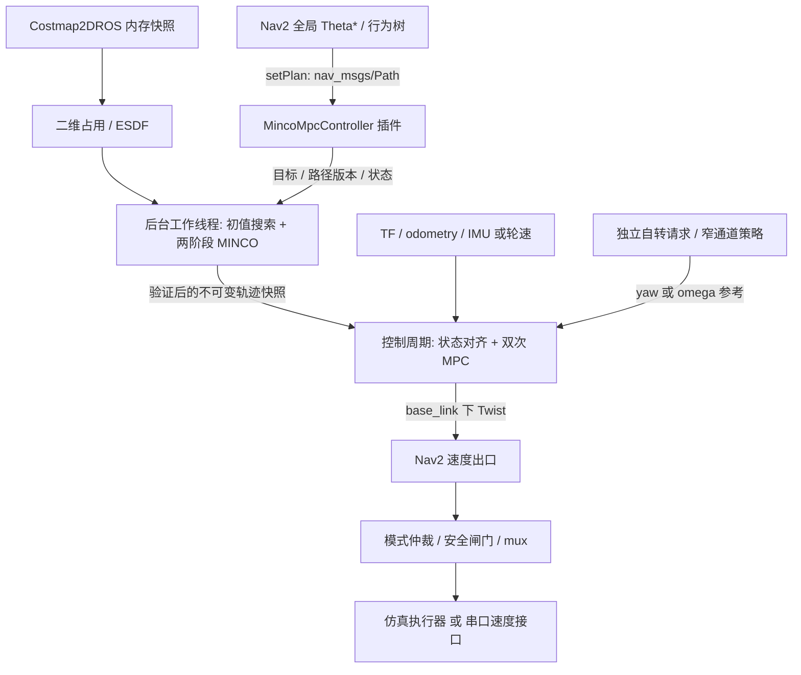

# 从 Omni PID 迁移到 MINCO + MPC 的详细实施方案

> 编写依据：桌面文件 `/home/srm/桌面/UTF-8__中科大哨兵2025技术报告.pdf`，重点为第 13–25 页、§5.5；以及本工作区当前源码。
> 补充工程参考：用户提供的 `/home/srm/navi_minco_bit`，重点为 MINCO 优化器、Nav2 MPC 插件与二维 EDT；源码审计与复用清单见 §3.5。
> 核查日期：2026-10-06（本地日期）。本文是**实施设计，不代表功能已经实现或实车验证通过**。
> 标记约定：**【报告】**表示报告明确记载；**【现状】**表示当前源码/配置可查；**【建议】**表示本项目拟实施的设计或初始调试值；**【待测】**表示必须通过仿真或实车辨识确认。

## 开头概括

本次迁移的目标是，把当前 `srm27_omni_pid_controller::OmniPidPursuitController` 从正式导航执行链中移除，改成**二维 ESDF + MINCO 局部轨迹优化 + MPC 轨迹跟踪**。MINCO 负责生成带连续位置、速度、加速度和时间信息的可行轨迹；MPC 负责依据实时状态跟踪轨迹，施加速度/加速度约束、补偿延迟，并协调窄通道朝向与开阔区自转。只换一个名字叫 MINCO 的 controller 插件、仍然追踪无时间折线路径，不算完成迁移。

推荐保留现有 **Nav2 全局 Theta*、导航 Action、行为树、感知/定位、代价地图及底盘速度接口**，新增一个 `srm27_minco_controller::MincoMpcController`，继续使用 `FollowPath` 这个插件 ID。插件内部以后台线程运行 ESDF/前端搜索/MINCO，以 Nav2 控制周期运行 MPC；核心算法做成不依赖 ROS 的库。这样可以逐步替换 Omni，同时保持现有决策系统对 Nav2 的调用方式。

必须优先解决三个当前工程问题：

1. **自转指令所有权。** SRM 仿真使用真实、随底盘旋转的 `base_link`；当前 `srm_cmd_mux` 明确丢弃导航指令的 `angular.z`。完整 SE(2) MPC 不能直接接上就指望控制航向，必须增加明确的导航/独立自转仲裁模式。
2. **速度链一致性。** 仿真 Omni/平滑器配置可到 2.5 m/s，但 mux 的合速度限制为 0.5 m/s。MINCO、MPC、平滑器和最终执行器必须使用同一套有效约束，避免上游一直追赶下游永远执行不到的速度。
3. **时间与状态可信度。** 报告的 LIO 100 Hz、IMU 200 Hz、轮速 1000 Hz 是对方系统的指标，不能当成本车现状。现有代码也不能证明本车已经具备完整轮速输入和延迟补偿，必须先验证 odometry 的坐标系、速度和时间戳。

开源采用“**北理 `navi_minco_bit` 作为优先工程参考，复用其 MINCO 优化器、纯 C++ 速度层 MPC 与二维 EDT；GCOPTER 用于数学核对/最小依赖替代，qpOASES 用于 QP，JPS 参考 jps3d**”的组合。用户提供的本地仓库已经包含 Humble Nav2 插件，不必从零重写全部算法；但其世界系速度出口、状态/轨迹约定和比赛专用补偿必须适配。中科大报告仍是两阶段优化、双次 MPC 与窄通道策略的目标依据，北理现有实现与报告的差异见 §3.5。

建议按“基线与接口 → MINCO 数学核心/ESDF → 低速 MINCO+MPC 闭环 → 完整避障与连续重规划 → SE(2) 与窄通道 → 仿真/实车回归 → 正式移除 Omni”推进。每阶段均有独立验收门槛；正式切换前保留 Omni 仅用于 A/B 对照和回退，最终默认启动链不再加载 Omni。

### 已确认的本车条件（用户补充）

- **实车与仿真均为全向轮底盘。** 规划控制保留独立 `vx/vy/wz` 自由度，不采用差速车约束，也不按报告的舵轮机构复制轮级约束。
- **当前雷达固定在底盘上，后续计划移到大 yaw 上。** 第一版按当前固定安装落地，同时给状态适配层预留带时间戳的活动关节变换。
- **机器人几何以本仓库模型为依据。** 当前仿真入口调用 `model_builder.py` 从 `srm27_sentry_geometry.yaml` 生成 URDF/SDF；仓库同时保留 `urdf/srm27_sentry.urdf.xacro`。应修改模型公共数据源，不能只改一个未被实际入口加载的 xacro。
- **测试起始速度 0.5 m/s，测试上限 1.0 m/s。** 这两个数值由用户明确指定；初期按 0.5 m/s 联调，验证后逐步提高，测试阶段不超过 1.0 m/s。数值均指平移合速度，不是各轴分别达到该值，也不是强制最低速度；起步、停车、避障和窄通道仍允许正常减速。
- **移植必须遵守本项目框架与代码规范。** 用户已明确要求；以当前 SRM/Nav2 架构、相邻包的 CONTRIBUTING、clang-format/clang-tidy 和生命周期约定为依据，具体执行要求见 §4.5。复用北理算法不意味着照搬其整套目录、运行框架或编码习惯。

这些补充确认了硬件类型、安装现状和测试速度范围；到点自转行为、比赛最终速度或 MPC 的旋转接管权限尚未由用户明确决定，仍按本文建议推进设计，正式行为切换时再落实。

## 1. 报告到底做了什么

### 1.1 应复现的完整链路

```text
静态地图 + 在线障碍信息
          ↓
二维 ESDF（连续距离查询及梯度）
          ↓
JPS 搜索 → 转角感知的时间分配 → 路标点与分段时长
          ↓
MINCO + L-BFGS：PRE_OPTIMIZATION → FINELY_OPTIMIZATION
          ↓
带时间信息的连续轨迹 + 障碍距离/窄通道信息
          ↓
状态同步与外推 → 首次 MPC → 参考轨迹重采样 → 第二次 MPC
          ↓
预测速度命令 + 底盘朝向策略 → 底盘执行
```

| 内容 | 报告依据 | 本项目处理 |
|---|---|---|
| MINCO 参数化与 L-BFGS 优化 | 第 13、16–17 页，§5.5.1、§5.5.4 | 必做；复用数学核心，自己实现二维地面代价和约束 |
| 二维 ESDF、二次插值 | 第 13–14 页，§5.5.2 | 必做距离/梯度接口；插值方案要以梯度一致性与窄通道实验验收 |
| JPS 与梯形速度分配 | 第 15–16 页，§5.5.3 | 先利用现有全局路径作为初值，再补局部 JPS 搜索 |
| 两阶段 MINCO 优化 | 第 17 页，§5.5.4.2 | 必做；先得到形状，再改善动力学与窄通道稳定性 |
| 三类重规划和保留旧轨迹片段 | 第 18–19 页，§5.5.4.4 | 必做，额外加入版本校验、拼接状态约束与失败制动 |
| SE(2) MPC、qpOASES | 第 20–24 页，§5.5.5 | 先平移闭环，再打通完整航向权限与双次 QP |
| 投影定位、第二次参考采样 | 第 24 页，§5.5.5.4.2–3 | 必做，处理低速方向不定与投影跳段 |
| 取约 10 ms 后预测速度输出 | 第 25 页，§5.5.5.4.4 | 实现可配置前瞻；10 ms 是对方参数，不直接当作本车延迟 |
| 按通道宽度切换自转/切向跟随 | 第 25 页，§5.5.5.4.4 | 必做，同时改造 mux 的角速度仲裁 |
| 控制力前馈 | 第 25 页，§5.5.5.6 | 报告讨论的进一步改进，不是其已部署接口；本项目列为后续独立增强 |

### 1.2 不应照搬或夸大的内容

- 【报告】两步优化示例约 10 ms，40 步预测的 QP 平均约 1 ms 内。它们是报告场景的测量结果，不是本项目硬件的性能承诺，也不能推出“双次 QP 的最坏延迟是 1 ms”。
- 【报告】PRE 对段时长相对平均值添加约束，上下比例 1.1/0.9；FINELY 使用切向梯度剔除、方向探测及约 0.5 的阈值。报告没有给出足以无歧义复现的完整源码，涉及 `scale`、`step`、损失函数/梯度的部分需要实验和数值检查。
- 【报告】每个动态障碍构建独立 ESDF 再合成是讨论中的扩展，报告写明“还没试”。第一版只承诺对新观测占用及时重规划，不宣称已经具备移动障碍的未来轨迹预测。
- 【建议】势谷中心的零梯度可能是正确解，不能要求“所有窄通道中心的梯度必须非零”；应检查插值是否产生错误的整片平坦区域，以及窄通道是否存在有效可行轨迹。
- 【建议】报告中优化失败后输出轨迹可用于调试；执行层仍必须经过碰撞、动力学与时间有效性检查，不能直接执行失败解。
- 【现状】已有 `局部规划器迁移MINCO_MPC方案(ai).md` 的部分论述依赖旧 fake 底盘、未经实测的频率和旧接口。本文按当前源码重新制定，不继承那些假设。

## 2. 当前工程审计与改造边界

### 2.1 实际运行链路

【现状】SRM 仿真入口是 `src/srm27_navigation/srm27_nav_bringup/launch/nav_srm_simulation_launch.py`：

```text
Nav2 controller_server / FollowPath
  └─ OmniPidPursuitController
       ↓ cmd_vel_controller（启用 smoother 时）
velocity_smoother
       ↓ cmd_vel_nav，Twist，真实 base_link 车体系
srm_cmd_mux ← rotation_velocity ← rotation_controller ← rotation_cmd
       ↓ cmd_vel_sim
srm_velocity_adapter → Gazebo 底盘速度执行插件
```

入口明确 `use_fake_vel_transform=False`。关闭 `use_velocity_smoother` 时，controller 直接输出到 `cmd_vel_nav`。`behavior_server` 和 `waypoint_follower` 也存在对导航速度出口的 remap，仲裁和停止逻辑必须覆盖恢复/等待行为，不能只考虑 FollowPath。

**实车不能直接套用这张图。** 当前 `nav_real_launch.py` 默认选择 `config/real/nav2_params_upstream.yaml`，而 `config/real/nav2_params_srm.yaml` 是另一份配置。`srm27_nav_protocol` 订阅 `cmd_vel_chassis` 并发送 `vx/vy/wz`。实施时需要新增/明确 SRM 实车入口，将真实 `base_link`、MINCO 参数、mux 输出与串口一次接齐；不能仅修改一份未被实际加载的 YAML 就宣布完成实车迁移。

### 2.2 已确认参数与风险

| 项目 | 当前证据 | 迁移要求 |
|---|---|---|
| ROS 版本 | 本机 `/opt/ros/humble`；插件使用 Humble `nav2_core::Controller` API | 以本机头文件为准，实现全部生命周期和 `setSpeedLimit()` |
| 控制周期 | SRM 仿真 `controller_frequency: 20.0` | 先 50 Hz，实测后 100 Hz；不能用 200 Hz mux 冒充 200 Hz 控制 |
| 全局规划 | `nav2_theta_star_planner/ThetaStarPlanner` | 首期保留；Nav2 Path 只提供几何初值 |
| BT 重规划 | `navigate_to_pose_w_replanning_and_recovery.xml` 中 `RateController hz="3.0"` | `setPlan()` 会反复到达，区分路径刷新与新目标 |
| 局部地图 | 5 m × 5 m、0.05 m/格、10 Hz 更新、5 Hz 发布 | 内存快照优先；100×100 栅格，不按整场地图估算 |
| 坐标系 | 全局 `map`，局部 `odom`，机器人 `base_link` | MINCO/MPC 固定在连续 `odom`；输出前转车体系 |
| 几何近似 | `robot_radius: 0.33` | 这是配置半径，不等于实测外接圆；窄通道阶段补真实 footprint |
| 地图层 | static + IntensityVoxelLayer + inflation | 由真实障碍占用构建 ESDF，不能把膨胀代价当距离 |
| 仿真限速 | Omni/smoother 最大分量 2.5；mux 合速度 0.5 m/s | 初期各层统一为 0.5 m/s，逐步提高到最多 1.0 m/s；提速时同步调整 mux，避免一直被旧 0.5 m/s 上限截断 |
| 自转输出 | mux 只采用 `rotation_velocity.angular.z` | SE(2) 完成前必须增加控制权限模式 |
| 看门狗 | mux 导航 0.3 s、自转 0.1 s；适配器 0.1 s | 明确“求解失效”与“进程掉线”两类故障；不可用重复旧命令掩盖失效 |
| 实车横向速度阈值 | `real/nav2_params_srm.yaml` 的 `min_y_velocity_threshold: 0.5` | 调到与传感器噪声相称的小值，防止低速横移被上层当成零 |
| 目标判定 | SimpleGoalChecker：位置 0.15 m，yaw 6.28 rad | 保留自由 yaw 时不能依赖它检查进洞对齐；另外验证停止速度 |
| 恢复行为 | 自定义 BackUpFreeSpace；速度可绕过 smoother | 与新停止/安全策略协调，在窄通道禁止未经 footprint 校验的侧向脱困 |

这些是静态代码审计结论；真实传感器频率、端到端延迟、附着系数、质量、惯量、最大制动能力均为【待测】。

模型几何已进一步核查，来源为 `src/srm27_robot_description/config/srm27_sentry_geometry.yaml`：

| 项目 | 当前仓库模型值 | 方案中的用途 |
|---|---|---|
| 底盘圆柱 | 半径 0.27 m，高 0.20 m，中心相对 base_link 高 0.15 m | 模型几何，不能将 0.27 m 当作整车避障半径 |
| 四轮 | 半径 0.075 m，宽 0.04 m，轮心 `(±0.18, ±0.18, 0.075)` m | 外形与杆臂几何参考；不能仅凭简化圆柱轮推断真实滚子方向/轮速映射 |
| 整车包络 | `collision.envelope_radius: 0.33` m | 第一版 MINCO、Nav2 和碰撞验证统一使用此模型包络 |
| 雷达安装平移 | `[0.15, -0.15, 0.22]` m，相对 base_link | 固定雷达 TF 和杆臂补偿 |
| 雷达安装旋转 | rpy 约 `[-4°, 0°, -90°]` | 读取完整旋转，不把雷达 x 轴当成底盘前向 |
| 大 yaw 关节 | 当前 SRM 模型没有 | 后续需显式新增关节及状态发布，不能假设已有动态 TF |

模型中的质量、惯量、摩擦系数是仿真参数，不自动成为实车辨识结果。当前简化仿真通过底盘速度执行插件实现全向运动，轮子外观/关节并不等于已经建立真实全向轮的滚子接触动力学；因此可用于验证规划、TF、控制和停止逻辑，轮级摩擦/功率性能仍需另外验证。

### 2.3 必须先修复的 odometry 语义

【现状】还需要重点检查两个实际函数，而不是只看话题名称：

- `loam_interface/src/loam_interface.cpp::odometryCallback()` 发布 `lidar_odometry`，填充雷达位姿，没有填充 twist。
- `sensor_scan_generation/src/sensor_scan_generation.cpp::publishOdometry()` 发布底盘 `odometry`，目前通过两次位姿差分计算速度；分母使用回调到达时的 `steady_clock` 间隔，平移差分是父坐标系分量，却直接写进 `twist.twist.linear`。

【建议】接 MPC 前将这部分纳入前置修复：

1. 位姿差分使用**消息采样时间差**，看门狗/耗时测量仍使用单调时钟；仿真倍速、暂停、回放时两者不能混用。
2. `Odometry.pose` 在 `header.frame_id` 下，`twist` 应表达在 `child_frame_id` 下；将父系差分速度旋转到底盘系后发布，再由 MPC 明确转回 `odom`。
3. 采用短窗口滤波/带协方差的状态估计处理差分噪声；重复时间戳、倒退时间、过大间隔和异常位姿跳变不得生成速度尖峰。
4. TF 查询失败不能被“返回单位变换”的分支伪装成有效定位。当前 `sensor_scan_generation` 存在这种回退，应增加有效标志/诊断，并禁止规划器把失效状态继续用于控制。
5. 核对仿真真值入口与 LIO 入口是否只有一个 `odometry`/TF 发布者。真值适配器保留了桥接的 twist，不能把 LIO 分支的问题误认为所有分支都一样。

这些问题会直接造成 MPC 初始速度错误、自转时横移方向错误以及仿真倍速后控制发散，优先级高于优化器调参。

## 3. 开源代码调查与采用方式

### 3.1 已核验的仓库

核查方式：读取 GitHub 仓库元数据、默认分支文件树、提交记录，并核查后续所列核心文件。以下“可用”表示存在对应源码；**本次编写方案没有编译这些上游工程，也没有证明它们能在本工作区直接运行**。许可证栏记录仓库标注，具体文件保留其原版权和许可证，正式引入时一并归档。

| 仓库/用途 | 核查结果 | 可复用程度与选择 |
|---|---|---|
| 用户提供的 [navi_minco_bit 本地仓库](/home/srm/navi_minco_bit/README.md) | README 标注北京理工大学追梦战队 2026 工程；本地已有 ROS2 Humble MINCO planner、Nav2 MPC 插件、内嵌 qpOASES 和 EDT；根许可证 Apache-2.0，部分源码另有许可 | **优先工程底座**；按 §3.5 拆出算法与适配层，不整套替换本项目感知/决策；本地 origin 是 `limaori/navi_minco_bit`，不把这个副本直接认定为官方最新版本 |
| [ZhangHaopeng-Dino/MINCO-Omni-Planner](https://github.com/ZhangHaopeng-Dino/MINCO-Omni-Planner) | 报告作者账号下的项目；默认分支文件树只有 `README.md` 和 `LICENSE`，仓库标注 AGPL-3.0 | **目前不能直接使用作者整套实现**；跟踪后续更新，但不让本项目进度依赖它 |
| [ZJU-FAST-Lab/GCOPTER](https://github.com/ZJU-FAST-Lab/GCOPTER) | 有 MINCO、轨迹、多项式求根、L-BFGS 源码；仓库 MIT | **数学基准与最小依赖备选**；北理已包含派生实现，实施时统一选一个轨迹核，不维护两套重复实现 |
| [coin-or/qpOASES](https://github.com/coin-or/qpOASES) | C++ QP 求解器及 hotstart 示例；仓库 LGPL-2.1 | **首选 MPC 求解器**；复用求解器，不等于已经有本车 MPC 模型和约束 |
| [KumarRobotics/jps3d](https://github.com/KumarRobotics/jps3d) | 同时提供二维/三维 JPS 相关实现；仓库 BSD-3-Clause | **首选 JPS 候选**；核查二维接口、地图适配和角点穿越行为后封装；不是只支持 3D |
| [ZJU-FAST-Lab/DDR-opt](https://github.com/ZJU-FAST-Lab/DDR-opt) | 有前端 JPS、MINCO 后端及 MPC/NMPC，仓库 GPL-3.0；面向差速机器人 | **参考地面前端/时间初始化流程**；不要直接把差速 MPC 当作全向 MPC，也不要直接把 ROS1/catkin 工程放进 Humble 启动 |

关于“有没有可以直接用的完整代码”：**北理仓库提供了可供移植的完整导航工程和 Humble Nav2 插件，是比单独算法库更直接的来源。** 中科大作者仓库仍只有预告；北理工程也不能仅替换插件类名就接入本车。它提供现成的 MINCO 目标/梯度、速度层全向 MPC、EDT、参考采样和工程封装；本项目主要工作转为拆分复用、修正已发现的不匹配、适配现有 Nav2/底盘，以及补齐报告特色功能。

### 3.2 具体应阅读/引入哪些文件

**GCOPTER：**

```text
gcopter/include/gcopter/minco.hpp       # MINCO 系数生成、能量与梯度回传
gcopter/include/gcopter/trajectory.hpp  # 分段多项式求值、导数和轨迹操作
gcopter/include/gcopter/root_finder.hpp # 轨迹极值/多项式根等依赖
gcopter/include/gcopter/lbfgs.hpp       # L-BFGS 优化器
LICENSE
```

【建议】先使用 `MINCO_S3NU` 对应的最小 jerk、五次多项式表达。保留上游三维接口时令 z 及其导数固定为 0，只向优化器暴露 x/y 和段时长；先不重写带状线性系统。之后如确需二维模板化，再单独做等价性测试。不要把多旋翼重力、推力/倾角约束搬进轮式底盘代价。

**qpOASES：**

```text
include/qpOASES.hpp
include/qpOASES/
src/
examples/example1.cpp
LICENSE / LICENSE.txt
```

从 `QProblem` 的 `init()/hotstart()` 学习固定 H/约束矩阵的工作方式；若需要每周期改变矩阵，则评估 `SQProblem`，不要只改内存而仍调用假定矩阵不变的热启动接口。封装 `solve()` 返回状态、求解耗时、迭代次数、约束残差，不能只返回一组控制量。

**JPS 与 DDR-opt：**

```text
# 优先从 jps3d 复用算法
include/jps_planner/jps_planner/jps_planner.h
include/jps_collision/map_util.h
src/jps_planner/

# 从 DDR-opt 阅读地面导航流程
front_end/src/jps_planner/
front_end/include/front_end/traj_representation.h
back_end/include/gcopter/
mpc_controller/src/mpc.cpp
mpc_controller/include/mpc_controller/mpc.h
```

DDR-opt 的控制器是“阅读对照”，不是本方案建议直接链接的控制器。使用差速约束会丢失本车 `vy` 自由度；其 NMPC/ACADO 生成工程也不是报告中的小型线性全向 QP。

### 3.3 固定版本与隔离引入

以下是本次访问默认分支时核验到的 commit，记录下来用于复现，**不是经本项目认证的发行版本**：

| 仓库 | commit |
|---|---|
| navi_minco_bit 本地工作副本 | `a860fa4cb17876e0f5d318c60143c943581d86f9`；本次检查工作树干净，origin 为 `https://github.com/limaori/navi_minco_bit.git` |
| MINCO-Omni-Planner | `9a023f4bef464a1403ef2cfb30695f41bd6ccd25` |
| GCOPTER | `e0444f6d47b84f972ced91746b05feb36ce1fd4f` |
| qpOASES | `9e40af7d170f440b7887fc4f9cf162f3f3ae24e8` |
| jps3d | `ef65e36a8930395535e4683b1710e514b81d2f43` |
| DDR-opt | `b8796b237d00b60da3d5496e15779ff02296e09a` |

【建议】先在工作区 `src/` 以外的研究目录拉取，避免 colcon 误发现 catkin 示例。下面是后续实施命令，本次没有执行：

```bash
mkdir -p "$HOME/minco_upstream_review"
cd "$HOME/minco_upstream_review"
git clone https://github.com/ZJU-FAST-Lab/GCOPTER.git
git -C GCOPTER checkout e0444f6d47b84f972ced91746b05feb36ce1fd4f
git clone https://github.com/coin-or/qpOASES.git
git -C qpOASES checkout 9e40af7d170f440b7887fc4f9cf162f3f3ae24e8
git clone https://github.com/KumarRobotics/jps3d.git
git -C jps3d checkout ef65e36a8930395535e4683b1710e514b81d2f43
```

正式接入时：GCOPTER 必要头文件放进独立 vendor 包；qpOASES 建 ament/CMake 包装；JPS 优先只包装算法目标。建立 `THIRD_PARTY_NOTICES.md`，记录来源 URL、commit、许可证、修改补丁和构建选项。若使用 DDR-opt 的实质性代码，单独处理该代码的 GPL 许可证要求，不能把整仓库统一标成 MIT。

### 3.4 MINCO 最小接入示意

以下使用已核查的 GCOPTER API，演示二维路标如何借助三维接口生成五次多项式。它只是数学核心的集成起点，**没有避障、没有时间优化、没有 Nav2 适配，不能直接上车**：

```cpp
#include <gcopter/minco.hpp>

// 单位：位置 m，速度 m/s，加速度 m/s²，时间 s。
// 每个 3x3 边界矩阵的列依次是 p、v、a；行依次是 x、y、z。
Eigen::Matrix3d head = Eigen::Matrix3d::Zero();
Eigen::Matrix3d tail = Eigen::Matrix3d::Zero();
tail.col(0) << 2.0, 1.0, 0.0;  // 仅作数学示例，不是赛场目标

Eigen::Matrix3Xd inner(3, 1);  // 两段对应一个内部路标
inner.col(0) << 1.0, 0.3, 0.0;
Eigen::VectorXd durations(2);
durations << 2.0, 2.0;

minco::MINCO_S3NU generator;
generator.setConditions(head, tail, 2);
generator.setParameters(inner, durations);
Trajectory<5> trajectory;
generator.getTrajectory(trajectory);

const Eigen::Vector3d position = trajectory.getPos(1.0);
const Eigen::Vector3d velocity = trajectory.getVel(1.0);
const Eigen::Vector3d acceleration = trajectory.getAcc(1.0);
```

这里“MINCO 生成系数”与“L-BFGS 搜索路标/时间”是两层：上面没有调用优化器，所以不会自动优化障碍代价。后续实现按 §6 的目标生成系数偏导/时间偏导，调用上游 `propogateGrad()`（源码确实使用这个拼写）回传到路标点和时长，然后给 L-BFGS。`Trajectory<5>` 的模板参数是多项式阶数，不是空间维度。

### 3.5 北理 navi_minco_bit：复用结论与具体移植清单

#### 3.5.1 来源、范围和实际调用链

用户指定参考目录：`/home/srm/navi_minco_bit`。本次读取了 README、包构建文件、插件接口、实际求解函数、地图查询/EDT、轨迹消息、规划发布与控制输出分支，结论以源码为准；**没有编译、启动或修改该参考仓库**。

本地 origin 为 `https://github.com/limaori/navi_minco_bit.git`，README 的克隆示例指向 `Walker152/navi_minco_bit`。记录本地 commit 与来源即可，不把两个远端的内容、维护者或最新状态视为已经核实一致。

北理当前链路为：

```text
Nav2 planner_server / minco_planner::MincoPlanner
  createPlan() 接收目标并返回起终点组成的最小 Path
  └─ 内部 FSM / 搜索 / ROGMap 查询 / MINCO
        ↓ /opt_path: ros_interfaces/MpcPositionCommand（离散 P/V/A/J + yaw）
Nav2 controller_server / minco_controller::MincoMpcController
  ├─ 订阅 /aft_mapped_to_init
  ├─ 调用 MpcSolver::solve()，每周期一次 QP
  ├─ 直接发布 /cmd_vel_mpc（世界系速度）
  └─ 同时向 controller_server 返回 TwistStamped（仍为世界系分量）
```

它不是“全局 Theta* + 一个原样可换的局部插件”：`createPlan()` 主动将真正规划移到内部 FSM，返回的两点 Path 不能当作搜索出的无碰撞路径。本项目继续保留 Theta*，从北理提取优化器和控制器核心；不照搬其 planner 插件替换 `GridBased`，也不让其独立 `/opt_path` 链和本项目插件后台线程同时规划同一任务。

#### 3.5.2 可复用文件与落点

下表相对路径均相对于 `/home/srm/navi_minco_bit`。

| 源文件/模块 | 源码已具备的能力 | 迁入本项目的方式 |
|---|---|---|
| `src/navigation/minco_controller/src/mpc_solver.cpp`、`include/minco_controller/mpc_solver.hpp`、`mpc_types.hpp` | Eigen + qpOASES 的纯 C++ 凝聚 QP，速度/角速度界、输入差分约束 | 优先迁到 `srm27_minco_core`，保留速度层模型作第一版基线；修正本节列出的权重/时间/执行反馈问题 |
| `src/navigation/minco_controller/src/minco_mpc_controller.cpp`、对应 hpp、`minco_controller.xml` | Humble Controller API、参考构造、yaw 展开、可视化、参数读取 | 复用插件骨架与有效算法段，改成现有 odometry/TF 和单一 Nav2 速度出口；删除本车不使用的直发执行路径 |
| `src/navigation/minco_planner/src/traj_opt/minco_optimizer.cpp`、对应 hpp | MINCO 路标/时间联合优化、ESDF/速度/加速度/路径吸引/时间惩罚、梯度回传、初值缓存 | 作为地面优化器起点，接本车快照 ESDF；随后增加中科大 PRE/FINELY 模式，沿用独立发布前验证 |
| `src/navigation/minco_planner/include/traj_opt/minco.h`、`data_structure/base/{trajectory,piece}.h`、相关 `src/utils/` | 五次 MINCO、分段曲线、带状系统、L-BFGS 和求根 | 按实际 include/链接依赖选取一致的一套核；不是只复制 `minco.h` 就能构建 |
| `src/navigation/minco_planner/src/minco_core/components/local_path_processor.cpp`、对应 hpp | 全局 Path 局部截取、稀疏初值、局部终点识别 | 复用处理流程，将 `PlannerModeContext`/ROG 边界依赖改为本项目地图快照接口 |
| `src/perception/rog_map/include/rog_map/esdf_utils.hpp`、`src/rog_map/esdf_utils.cpp` | 独立二维 EDT，接口只依赖标准库，OpenMP 可选 | **优先直接封装复用**，接 costmap 二值 mask；不为 EDT 单独引入完整 ROGMap |
| `src/perception/rog_map/include/rog_map/map_query_interface.hpp`、对应 cpp | 查询有效性、距离、梯度、地图版本与年龄字段 | 提取/适配为核心查询接口，并提供本车 costmap→ESDF 实现；同时处理默认虚函数实现依赖 |
| `src/navigation/minco_planner/src/minco_core/components/trajectory_safety_checker.cpp` | 轨迹安全与障碍投影处理 | 参考其检查流程，统一到本项目一次发布前验证，补充 footprint 与拼接检查；不自动接受起点平移 |
| `src/navigation/minco_planner/src/traj_opt/yaw_traj_opt.cpp` | 航向多项式优化 | 后续评估使用，不能等同于已经实现报告的窄通道模式仲裁 |
| `src/ros_interfaces/msg/minco_traj/{MpcPositionCommand,PositionCommand}.msg` | 离散 P/V/A/J、yaw/yaw_dot、轨迹 ID 和命令标志 | 借鉴字段，不把裁判系统等整个 `ros_interfaces` 包搬入；首版同进程直接取多项式，若拆节点再定义所需消息 |
| `src/navigation/minco_controller/third_party/qpOASES` | 已随仓库提供求解器源代码和许可文件 | 可包装成本项目唯一 qpOASES vendor，保留本地快照来源；不要再链接另一份版本不同的 qpOASES |

`ESDFUtils::computeEDT2D()` 的 mask 约定为 **0=障碍/种子、1=非种子**，返回的是**格单位的距离平方**；转换到米需 `sqrt(dist_sq)*resolution`，再按 §6 处理符号和栅格表面偏差。它本身不提供 signed field、二次插值、地图年龄或机体半径，不能把函数返回数组直接当完整 ESDF 服务。

#### 3.5.3 与中科大报告的差异

| 项目 | 北理本地有效代码 | 本方案的最终要求 |
|---|---|---|
| MPC 模型 | `buildStepModel()` 为 `A=I3, B=dt*I3`，状态 `[x,y,yaw]`，决策量 `[vx,vy,wz]`；State 里的速度字段不代表六维预测状态 | 初期优先复用；报告六维加速度/力模型作为后续独立替换与对照，不混写状态维度 |
| QP 次数 | 控制周期内一次 `solver_->solve()` | 按 §7.3 增加报告式第二次参考采样/求解；完整报告特性验收时不可漏项 |
| QP 热启动 | `solve()` 每次新建 `QProblem` 并 `init()` | 首期保持行为可核验；需要提高频率时再改可更新矩阵的持久求解器，不能称其已有热启动 |
| 横向误差处理 | 按参考 yaw 构造横纵向不同的 Q；不是报告的 alpha 二次采样 | 先修正旋转公式，并使用**轨迹平移切线**，自转时不能拿底盘 yaw 代替路径方向 |
| MINCO 优化 | 主入口一次 L-BFGS，包含路径吸引等项 | 复用基础目标/梯度后添加 PRE/FINELY；当前主链未体现报告所述两阶段策略 |
| 搜索 | 工程采用 A*/SMAC 等搜索组件 | 初期保留本车 Theta* 初值；JPS 仍作为报告对齐阶段新增，不把北理称为现成 JPS 链 |
| 轨迹表示 | `/opt_path` 传离散采样点，控制端按 `1/planner_freq` 推断间隔，P/V/A/J 泰勒插值 | 优先同进程连续多项式求值；离散消息若保留，显式传时间/时长与会话有效期 |
| 全局/局部框架 | GlobalPlanner 插件 + 自有 FSM + ROGMap | 复用算法到本车局部插件，保留现有全局规划和感知 |

因此，**北理提供可复用的实现基础，中科大提供需补齐的目标行为。** P2 先以北理速度层单次 MPC 跑通 0.5 m/s 基线，后续加入双次 MPC、PRE/FINELY、连续重规划和窄通道策略；不能用“采用了北理代码”代替对这些目标的验收。

#### 3.5.4 已定位的移植修正项

以下是本地 commit 的静态检查发现，不代表已在北理实车上复现故障；这里规定**迁入 SRM 时必须处理的边界**，本次不修改参考仓库。

1. **统一速度出口和坐标系。** `computeVelocityCommands()` 既返回世界系 TwistStamped，又直发 `/cmd_vel_mpc`；其中目标 0.3 m 内停止只应用到直发分支，GoalChecker/无参考/求解失败的提前返回又不统一走该直发分支。迁入后只保留 controller_server 的标准执行出口，返回前转为真实 `base_link` 分量，各停止分支一致；不靠 remap 把世界系 Twist 直接接入现有 mux。
2. **修正旋转权重。** `buildCondensedQP()` 当前交叉项为 `(q_cross-q_along)*cos(theta)*sin(theta)`。若 theta 是世界系中的路径切线角、代价要求切向权重 qa/法向权重 qc，则应构造 `Qxy=qa*t*t^T+qc*n*n^T`，交叉项为 `(qa-qc)*cos(theta)*sin(theta)`。先用 θ=π/4 验证 `t^T Q t=qa`、`n^T Q n=qc`，再用于窄通道；自转参考 yaw 与路径切线必须拆开。
3. **输入差分使用真实控制间隔。** solver 用 `last_u_global_` 作为首步基准，而不是注释中的实时测量速度，且首步也乘模型 dt。100 Hz 控制、模型 dt=0.05 s 时，首步命令变化不能继续按 50 ms 放宽。首步用实际控制间隔与上一条实际执行命令；预测后续步用模型 dt。增加 applied-command 更新和新目标/取消/失活时的 reset 接口，避免限幅/死区后 solver 仍记着未执行的原始 u0。
4. **补充合速度界。** 北理 solver 仅按 vx/vy 分量设置 box bounds。本项目 0.5 m/s 起始、1.0 m/s 上限都指向量模长，需加入 §7 的保守多边形约束；不能只令两个轴都取 ±1.0，就认为总速度不超过 1.0。
5. **补回轨迹进度与时效约束。** README 宣称单调进度，但 `buildReferenceFromOptPath()` 中按时间推进/不回退的分支和 0.5 s 超时检查已经注释；有效实现仍按整条采样轨迹最近点取索引。按 §5 的局部搜索窗口、进度连续性、时间有效期实现，自交与旧轨迹必须有专门测试。
6. **状态与生命周期不能缺省成功。** `activate()/deactivate()` 当前为空；无 odom 时按零速度继续，控制分支未统一检查 odom 新鲜度。迁入时使用本车有效状态适配，失效停机并作废轨迹/命令会话；绝对话题 `/opt_path`、`/aft_mapped_to_init` 改成适配后的相对接口或同进程调用。
7. **删除他车专用补偿假设。** 有完整 3D 速度提取函数不代表已被调用，当前有效分支调用的是二维 `compensateLeverArm()`；另有硬编码 `output_delay=0.025` 的相位旋转。按本车 URDF 外参、真实采样时间和大 yaw 改装约束重做适配，不重复补偿已经转换成底盘中心的 odometry，也不直接复制雷达偏移和 roll 值。
8. **Nav2CostmapQuery 不是 ESDF。** 北理 `map_query_adapters.cpp::Nav2CostmapQuery::query()` 返回“障碍 -1.0，否则 resolution”，梯度恒为零；可服务占用/搜索查询，不能直接作为 MINCO 障碍梯度。必须接真正的 EDT/插值快照查询。其 253/254 障碍语义也需按 §6 区分膨胀层与原始占用。
9. **检查热启动和起点排障。** `determinePlanningState()` 某些打印“降为冷启动”的分支实际返回 HOT_START；`prepareHotStart()` 将当前实测位置与旧轨迹 v/a 拼成边界；`projectOutOfObstacle()` 会修改优化起点。迁入时按状态偏差和可行拼接处理，不能把优化起点挪出障碍后忽略机器人仍在原位置的事实。
10. **采样消息不是精确多项式。** 当前 `PositionCommand` 没有独立相对时间字段，发布时每个点复用消息 header；控制端按参数推断间隔，泰勒展开只到 jerk。五次多项式据此不能全段精确重建。本项目按 §5.3 使用权威系数/时长，若保留临时消息适配，则明确其近似精度和末端规则。
11. **命令标志需要明确处理。** `MpcPositionCommand` 有 `NORMAL_COMMAND/BLOCK_COMMAND`，所读控制器没有对应标志分支。不能把它默认解释为已经实现急停/阻塞协议；应改为本项目统一的状态/会话契约并测试停止和恢复。
12. **统一 ROS 时间和执行上下文。** planner 多处使用默认 `rclcpp::Clock().now()` 与 wall timer；迁入仿真需要使用节点 ROS clock 对齐轨迹时间，单调时钟只负责耗时/看门狗。后台线程按本项目插件生命周期管理，不复制原 planner 的 timer 并留下第二个发布者。

关于速度限制还要保留 Nav2 原本语义：`NO_SPEED_LIMIT` 解除限制、绝对限速、百分比相对配置最大速度分别处理。北理当前百分比在最终输出上做比例缩放；迁入时需验证其与 Nav2 的约定一致，并把有效限制提前纳入参考与 QP，避免长期后裁剪。

#### 3.5.5 许可证和最小依赖边界

- 根 LICENSE 为 Apache-2.0；保留北理工程来源、版权与本地 commit。
- 实际 `MincoOptimizer` 引用的 `traj_opt/minco.h` 同时带有 **SUPER LGPL-3.0-or-later** 和 GCOPTER **MIT** 声明；另一个 `utils/optimization/minco.h` 带 MIT 声明。两者不能只看文件名就互换，更不能因根目录 Apache-2.0 而覆盖各文件许可。
- 内嵌 qpOASES 保留 LGPL 声明和来源；若采用这份，就在依赖记录中固定北理 commit 和对应 vendor 路径，不声称其版本等于此前联网核查的 qpOASES 默认分支 commit。
- 第一版优先引入纯 MPC、EDT 和地面优化器必需依赖；`ROGMap` 的感知/投影大模块、Point-LIO、communication、裁判接口、整套 BT 和仿真子模块不随之搬入。
- 地图查询接口可抽出适配并保留许可；若选择直接链接现有 `rog_map`，需要明确这是额外架构范围，不能因一个头文件依赖而默默替换本车感知。

#### 3.5.6 对本方案落地顺序的调整

1. P1 优先迁入北理 EDT、MINCO 数学核/优化目标以及必要轨迹类型，先通过 §11 的数值检查；GCOPTER 保留为结果对照，不并行维护两套生产实现。
2. P2 优先迁入并修正 `MpcSolver` 与插件适配，用本车 odometry、真实 `base_link` 输出、标准 FollowPath 单出口建立 0.5 m/s 闭环。
3. P3 接入真实 ESDF 查询、局部初值处理、两阶段 MINCO 和轨迹独立验证；北理 Nav2CostmapQuery 的零梯度占位实现不得作为最终障碍查询。
4. P4 补齐报告双次 MPC、状态一致的重规划、SE(2) 仲裁和窄通道策略；报告六维模型作为独立实现/对照，接口保持同一执行语义。
5. 通过测试后逐步从 0.5 提高到最多 1.0 m/s。复用减少基础算法重写量，但不减少停止、坐标系、数学一致性、实车和回归验收；整体工期仍按原范围预估，P1/P2 后依据实际可编译依赖与测试结果重估。

这一节是前文开源选型的更新依据；它不授权修改参考仓库或立即切换本项目运行链。本次仅更新用户指定的实施方案及其索引，参考源码中的问题留作迁入时处理。

## 4. 目标架构、包拆分和线程设计

### 4.1 选定的架构



【建议】第一版采用“一个 Nav2 插件 + 内部算法库 + 后台工作线程”。不一开始同时开发独立 MINCO 节点和插件内 MINCO 两套路径；将来需要跨进程部署时，再基于相同核心库拆节点。

该拆分在加入北理参考后保持不变；包名表示最终 SRM 模块职责，内部代码优先从 §3.5 所列文件迁入。不要把“新增本车包”理解成全部算法从零重写。

这样仍是两种频率的规划控制：MINCO 在后台低频或事件触发执行，MPC 高频读取最新有效轨迹。不能把 ESDF 重建和 L-BFGS 塞进 `computeVelocityCommands()`，也不能把规划耗时压到 Nav2 控制截止期内作为唯一安全措施。

### 4.2 建议新增目录

```text
src/srm27_navigation/
├── srm27_minco_vendor/                  # 上游头文件、版本和许可证
├── srm27_qpoases_vendor/                # 求解器编译/导出包装
├── srm27_jps_vendor/                    # 可选，二维前端接入阶段增加
├── srm27_minco_core/                    # 无 ROS 依赖，Eigen + vendor
│   ├── include/srm27_minco_core/
│   │   ├── grid_snapshot.hpp
│   │   ├── esdf_2d.hpp
│   │   ├── trajectory.hpp
│   │   ├── trajectory_initializer.hpp
│   │   ├── minco_optimizer.hpp
│   │   ├── replan_manager.hpp
│   │   ├── mpc_model.hpp
│   │   ├── mpc_solver.hpp
│   │   └── trajectory_validator.hpp
│   ├── src/
│   └── test/
└── srm27_minco_controller/              # Nav2/ROS 适配
    ├── include/srm27_minco_controller/
    ├── src/minco_mpc_controller.cpp
    ├── src/state_adapter.cpp
    ├── src/costmap_adapter.cpp
    ├── src/yaw_policy.cpp
    ├── src/diagnostics.cpp
    ├── srm27_minco_controller.xml
    ├── CMakeLists.txt
    └── package.xml
```

如需要轨迹消息、仲裁租约/状态消息，再增加 `srm27_planning_interfaces`；首期同进程直接传不可变 C++ 对象即可，避免先为并不存在的跨进程链路堆消息包。

### 4.3 Nav2 插件合同

| 方法 | 必须实现的行为 |
|---|---|
| `configure()` | 声明/检查参数，取得 tf/costmap，预分配 MPC 矩阵和缓存，建立状态与诊断接口；不启动实际运动 |
| `activate()` | 激活生命周期发布者和工作线程，清除旧租约、旧轨迹与求解器状态 |
| `setPlan()` | 校验 Path、转换目标描述、更新路径版本、唤醒规划；不在调用线程直接求解；同目标刷新保留可用轨迹 |
| `computeVelocityCommands()` | 取得一致状态，检查地图/轨迹/租约，做 MPC、校验输出，返回 `TwistStamped`；正常速度发布由 controller_server 完成 |
| `setSpeedLimit()` | 支持绝对/百分比限制及解除限制语义；统一收紧 MINCO 和 MPC 上限，立即处理已有轨迹超限 |
| `deactivate()` | 停止授权、唤醒并停止后台任务，清理轨迹，禁止 worker 在退出后回写；配合 server/mux 零输出 |
| `cleanup()` | join 线程并释放资源；能重复 configure/activate，不遗留旧订阅和锁 |

Humble API 依据本机 `/opt/ros/humble/include/nav2_core/controller.hpp`。插件导出示意：

```xml
<library path="srm27_minco_controller">
  <class name="srm27_minco_controller::MincoMpcController"
         type="srm27_minco_controller::MincoMpcController"
         base_class_type="nav2_core::Controller"/>
</library>
```

实际类需使用 `PLUGINLIB_EXPORT_CLASS`，CMake 使用 `pluginlib_export_plugin_description_file(nav2_core ...)` 并导出共享库。新增依赖包括现有 Nav2 controller 所需库、Eigen、各 vendor 包及诊断/可视化消息；不要仅改 YAML 而漏装插件 XML。

### 4.4 线程和数据一致性

- costmap 互斥锁只覆盖“复制 origin/resolution/size/cost 数组和必要版本”，随后立即释放。EDT、插值、JPS 和 MINCO 都在副本上运行。
- 规划任务携带 `goal_epoch / path_version / map_version / limits_version / state_stamp`。`goal_epoch` 变化、限速变化或生命周期停止后，旧任务不能覆盖新轨迹。
- 对相同目标 3 Hz 刷新的 Path，比较路径形状/局部走廊变化，避免每次刷新重置控制进度；新目标、取消后重发同坐标目标也必须有新会话编号。
- 任务队列长度取 1，忙时只保留最新请求；支持 deadline 和取消检查。地图持续 10 Hz 更新时，不能要求版本绝对相等导致永远发布失败；应在提交时用最新占用图复验可执行前缀，差异过大才重算。
- 轨迹快照使用 `shared_ptr<const Trajectory>` 加短锁或 C++17 支持的 shared_ptr 原子装载/存储；控制端拿到快照后无需持规划锁。
- 首次无轨迹返回受控零输出并计时；超过建轨宽限或持续求解失败，使用当前 Nav2 支持的 controller 异常返回失败，让 BT 处理。不能永远返回零并假装正常，也不能输出上一个目标的速度。

### 4.5 框架边界与代码规范（用户明确要求）

#### 4.5.1 架构保持与依赖方向

迁移围绕现有 **Nav2 FollowPath 扩展点**进行：上游保留 Theta*、导航 Action 与行为树，下游保留本车 mux、仿真适配器/串口。新增局部规划与控制算法放进 core，ROS 的状态/地图/参数/生命周期适配放进 controller，底盘最终权限由 chassis_control 负责。

依赖方向固定为：

```text
srm27_minco_controller → srm27_minco_core → Eigen / MINCO 数学核 / qpOASES / EDT
srm27_nav_bringup → controller 插件 + 参数 + launch
srm27_chassis_control ← 经约定的速度/模式接口
```

约束如下：

- core 不包含 `rclcpp`、Nav2、TF、Point-LIO 或 ROGMap 节点；状态和地图通过小型、明确的值类型/只读接口传入。北理带 ROS 依赖的流程组件要经过提取适配，不能仅移动文件就宣称已经解耦。
- 插件不直接调用串口/Gazebo，不私自另发执行速度；保留 `FollowPath` ID、Nav2 标准函数及单一正常命令出口。
- 不整包搬入北理的 `communication`、`bt_manager`、`ros_interfaces` 或感知框架；只在确需跨进程时新增最小消息包。
- §4.2 是职责示意，文件按实际复杂度拆分；不要为了目录好看给每个函数建类/包。首期落实 core、controller 及必要 vendor，JPS、独立消息/节点到对应阶段才增加。
- 第三方算法保存在可追溯 vendor 区，SRM 修改保存在薄适配层或有记录的补丁；不复制多个 MINCO/qpOASES 版本，不混用不兼容的轨迹类型。
- 一项改造围绕一个明确行为或接口，修改相邻代码时沿用其约定；不顺手重排旧模块、批量改名、删除历史逻辑或重新格式化全仓库。

#### 4.5.2 已核查的本项目规范来源

1. [`src/srm27_navigation/CONTRIBUTING.md`](../src/srm27_navigation/CONTRIBUTING.md)：要求修改聚焦具体问题，避免混入全仓库格式化；实施代码需完成相应测试。
2. [`srm27_omni_pid_controller/.clang-format`](../src/srm27_navigation/srm27_omni_pid_controller/.clang-format)：现有 Nav2 controller 的 C++ 格式基准，Google 风格派生、100 列、既定换行/大括号/指针对齐规则。
3. [`srm27_omni_pid_controller/.clang-tidy`](../src/srm27_navigation/srm27_omni_pid_controller/.clang-tidy)：类名 CamelCase、方法 camelBack、变量 lower_case、私有/受保护成员末尾 `_` 等规则，以配置实际检查为准。
4. [`srm27_omni_pid_controller/CMakeLists.txt`](../src/srm27_navigation/srm27_omni_pid_controller/CMakeLists.txt)：C++17、ament、pluginlib 导出和 clang-format/clang-tidy 检查的现有实现。
5. [`srm27_chassis_control/CMakeLists.txt`](../src/srm27_chassis_control/CMakeLists.txt)：纯逻辑 core 与 ROS 节点拆分、gtest、目标链接/安装的本项目示例。修改 chassis_control 时遵循该包既有命名与格式，不强行把整包改成另一个子包的风格。

仓库根目录当前没有统一 `.clang-format/.clang-tidy` 可供所有包自动继承，因此**新增 controller/core 包必须带明确的检查配置**，优先采用相邻 Nav2 controller 的规则。vendor 原样文件保留上游格式和许可，限制格式化/静态检查范围，避免因导入第三方源码导致全量无意义改写。

#### 4.5.3 C++、参数与错误处理要求

- 新增受本项目维护的接口使用 `srm27_*` 命名空间、`snake_case.hpp/.cpp` 文件名；类型/方法/成员遵循所选配置，Nav2 override 保留官方签名。公共头文件采用唯一 include guard、自包含 include，不放 `using namespace` 或 ROS 全局对象。
- 算法函数输入输出明确单位、参考系、时间语义和有效性；用 `State2D`、`Trajectory2D`、`SolveResult` 等有含义类型，禁止用一组不带语义的数组跨层传递。
- 对象用 RAII 管理；工作线程、订阅和缓存在生命周期退出时可停止/清理。禁止 detached worker、跨实例 static 状态、持 costmap 锁执行优化，以及生命周期停止后的回写。
- solver 返回明确结果状态、耗时/约束残差；日志由 ROS 适配层节流输出。core 不使用高频 `std::cout`，诊断/CSV 保持可关闭、有界，不能在控制热路径同步大量刷盘。
- 热路径矩阵/缓冲区在配置时尽量预分配；首先保证数学和接口正确，再依据测量改热启动/缓存，不以性能理由跳过错误检测。
- 外参从本车模型/TF 取得；限速、延迟、超时和权重有单位与参数说明。避免硬编码绝对话题、用户主目录、赛场坐标、他车杆臂和 `output_delay=0.025` 等补偿值。
- 同一参数名在 YAML、declare/get、动态回调、文档中一致；范围非法时配置失败并报清楚原因，不静默退回另一套值。动态修改采用一致快照，防止 QP 的 N/dt/权重在求解中途改变。
- 新旧参数迁移一次定义清楚，不同时维护 `vx_max`、`max_vel`、`max_linear_speed` 三套互相覆盖的无文档入口；北理参数通过适配映射进入本车 `FollowPath.*`，原参数表只作对照。
- 公开函数注释解释边界和不变量，中文/英文沿用所在文件习惯；注释必须和有效执行分支一致，不保留“降冷启动”却返回 HOT_START 这类误导描述。

#### 4.5.4 构建、依赖与检查要求

- C++17，遵循现有 ament/pluginlib 包结构；CMake 明确列出 SRM 源文件和依赖，使用目标级 include/link/compile 配置。不要复制北理工程强制 `CMAKE_BUILD_TYPE=Release`、全局宏或整目录 GLOB 作为本车默认风格。
- vendor 只编译所需库目标，正确设置 PIC/导出/安装，不把上游示例与测试全部引入生产包；缺依赖在 configure 时明确失败，不能只设置一个未检查的 `_QPOASES_LINKED` 标志后继续。
- `package.xml` 中运行/构建/测试依赖与 CMake 对齐，填本项目维护信息；保留原作者署名和每个引入文件的许可证，不沿用 `TODO/you@example.com` 占位。
- 新增代码至少通过格式检查、所选 clang-tidy/ament lint、相关数学/接口单测和 pluginlib 加载验证；只格式化本次新增/修改的受维护文件，不全仓库改写。
- gtest 重点覆盖权重旋转、首步 dt、合速度界、采样/坐标/时间、失败/取消/生命周期等行为；不为简单搬文件编写“断言文件存在”类测试冒充算法验证。
- 组合和非组合 launch 使用相同的参数和 remap；安装后能通过包 share/library 定位，不能依赖开发机源码绝对路径运行。

本次是方案修订，只做源码阅读、文档/YAML/XML 的静态核查，没有编译或加载新插件。北理参考仓库的 `AGENTS.md` 明确禁止未授权构建；本次不需要构建，因此不以申请构建权限阻塞文档完成。

#### 4.5.5 审阅完成门槛

每批实现交付均检查：依赖方向正确、无旁路执行出口、坐标/时间/停止契约一致、参数唯一、许可证/来源完整、改动只覆盖当前任务、对应检查通过。算法复用和本车适配分清，性能数据标注来源；未编译/未实车验证的部分明确标记，不把文档完整度当成实现完成度。

## 5. 坐标系、状态与轨迹接口

### 5.1 坐标系定死，转换只做一次

【建议】定义：

- `map`：全局路径/目标、静态场地图。
- `odom`：短时连续的局部规划、MINCO 多项式与 MPC 状态。
- `base_link`：真实旋转底盘，最终 `cmd_vel_nav` 的速度分量。

设机器人 yaw 为 ψ、在 `odom` 中平移速度为 `v_o`，则输出 `v_b = R(ψ)^T v_o`，输入底盘系反馈则 `v_o = R(ψ)v_b`。二维角速度不受这次平面坐标旋转影响。**MPC 的预测模型固定在 odom 下，不在每一步使用正在旋转的 base_link 当惯性系。**

若输入速度是在雷达位置测得，还需补偿杆臂 `v_lidar = v_base + ω × r_base_to_lidar`；仅旋转坐标不能完成位置偏移补偿。重定位造成 `map→odom` 跳变时，保留真实 `odom` 连续性，并重新转换全局目标/路径；若 `odom` 自身重置，立即废弃轨迹和 MPC 热启动。

### 5.2 状态接口

```text
State2D
  sample_stamp_ros      # 原始采样时间，用于状态对齐
  received_steady       # 接收时刻，只用于超时与耗时
  frame_id = odom
  x, y, yaw_unwrapped
  vx_odom, vy_odom, omega
  ax_odom, ay_odom       # 有可靠估计才使用，否则明确标为不可用
  covariance / validity_flags / source
```

控制时先估计到当前时刻，再根据命令生效延迟做预测；不要同时在状态外推和轨迹时间中无区分地把同一延迟加两次。没有轮速时可先用修复后的差分里程计做低速闭环，但应降低动态要求，不能把假定频率填成 1000 Hz。

### 5.3 精确轨迹接口

首选同进程存储五次多项式系数；如果之后需要 ROS 消息，按相同语义序列化：

```text
Trajectory2D
  frame_id = odom
  generated_stamp_ros
  valid_after_ros / valid_until_ros
  goal_epoch / trajectory_id / source_path_version / map_version / limits_version
  representation = QUINTIC_LOCAL_TIME
  piece_durations[M]                 # 秒，严格 > Tmin
  x_coefficients[M][6]
  y_coefficients[M][6]
  # 第 i 段 p(tau)=c0+c1*tau+...+c5*tau^5, tau∈[0,Ti]
  terminal_is_global_goal
  committed_prefix_duration          # 新轨迹切换/拼接使用
  clearance_samples[] / narrow_intervals[]
```

外部统一系数顺序为 `c0→c5`，内部若使用 GCOPTER 的其他存储顺序，适配器显式翻转并做往返测试。位置、速度、加速度、jerk 都从同一条多项式解析求值；可视化 Path 只是采样显示，不是控制端权威输入。

如果改为传“路标点+时长”以重建 MINCO，必须同时传**首末端完整 p/v/a 边界、阶数、边界约定和算法版本**。单独给路标点、起始速度和时长，通常不足以唯一确定本方案所用五次 MINCO，不能声称控制端必然精确重现。

### 5.4 区分执行时间与轨迹进度

报告通过最近点投影选取跟踪起点，并不等于要求机器人完全追赶发布时刻的绝对时钟。定义单独的 `tau_progress`，每周期在上一次进度附近搜索投影点，再沿几何轨迹采样；同时用 `generated_stamp/valid_until` 判断新鲜度。这样堵转后不会突然去追远处的“墙钟进度”。

投影搜索限定在当前段附近和连续前进窗口，跨越自交点时不得跳到远处另一段；允许有限回退恢复误差，禁止因每次重规划无限倒退。轨迹接近末端时切到停止/目标姿态策略，不能简单反复采样末点却保持非零参考速度。

### 5.5 后续雷达迁到大 yaw 的兼容设计

**MINCO/MPC 仍规划和控制底盘中心，雷达换安装位置不要求更换规划算法。** 需要重点修改定位输出到底盘状态的转换，以及传感器运动的时间同步。

当前和未来 TF 分别为：

```text
当前：odom → base_link → front_mid360（固定）
未来：odom → base_link → big_yaw_link（动态）→ front_mid360（固定）
```

`big_yaw_link` 是建议新增名称，不是仓库现有 link。由真实关节编码器发布有采样时间戳的 `joint_states`，交给 robot_state_publisher 产生动态关节 TF。仿真也需要让传感器实际挂到转动 link，而不是只转 RViz 里的显示。

用同一采样时刻的变换计算底盘位姿：

```text
T_odom_base(t) = T_odom_lidar(t) * inverse(T_base_lidar(t))
```

实施必须处理：

1. **不缓存活动外参。** 当前 `loam_interface` 初始化时查询一次 `base_frame→lidar_frame` 并缓存，后续又参与世界系对齐；移动雷达时不能简单把缓存 TF 改成“最新 TF”就结束。要将固定的 LIO 世界系→odom 对齐，与每次采样的底盘→雷达活动外参拆成两个独立量。
2. **全链路同一时间。** 位姿、关节角和点云对应的关节状态按采样时间插值；禁止用回调到达时的最新关节角替换历史角度。高角速度下需核查点云去畸变与逐点时间，不用一帧末尾的 yaw 硬转整帧点云冒充去畸变。
3. **IMU 是否与雷达刚性固定。** 优先继续使用随雷达一起运动的 MID360 内置 IMU 作为 LIO 输入，保持 LIO 的雷达–IMU固定外参前提；若改用底盘 IMU，活动关节会破坏此前提，需要支持活动外参的估计方案，不能只改 TF。
4. **底盘角速度必须独立恢复。** 雷达在大 yaw 上时，其 yaw/角速度包含关节转动，不能直接作为 MPC 的底盘 yaw/omega。使用底盘 IMU/可靠底盘状态或经过关节补偿的估计。
5. **速度增加关节相对运动项。** 在同一表达坐标系下，`v_lidar = v_base + omega_base × r_base_lidar + v_relative_joint`；偏置安装的大 yaw 转动产生额外线速度。只做坐标旋转或沿用固定杆臂公式会把传感器运动误判为底盘移动。
6. **TF 拓扑只保留一条父链。** 若 LIO 提供雷达位姿，由适配层恢复并发布唯一的 `odom→base_link`，其余关节链由 robot_state_publisher 发布；不要同时发布第二条 `odom→front_mid360` TF 造成同一 child 多父或闭环。
7. **感知朝向与底盘朝向分开。** 雷达转到大 yaw 后，“把雷达转向通道”和“让底盘适合通过通道”不再是同一动作。底盘 MPC 仍输出底盘速度，大 yaw 由独立关节控制器接收感知朝向请求，并服从自瞄/决策的权限约定。

当前采用圆形 0.33 m 包络时，旋转不会改变这个二维碰撞几何，不能仅根据报告就声称底盘对齐能缩小过道所需宽度；是否需要底盘对齐应结合实际外形、轮组能力和感知策略。移动雷达后的包络需要覆盖关节全行程扫掠范围，或使用带关节状态的碰撞模型。

该改装单独设置验收：底盘静止只转大 yaw 时，底盘估计位置/yaw 不随之转动；底盘与大 yaw 同向/反向旋转时仍能正确分离；编码器延迟、掉线、±π 跨越会使状态正确失效或连续展开；补偿后的点云与静态地图一致。先完成当前底盘固定雷达版本，后续改装不阻塞本次 MINCO 迁移。

## 6. ESDF、搜索与 MINCO 优化实现

### 6.1 从现有 costmap 建立二维距离场

【建议】第一版直接从插件持有的 `Costmap2DROS` 内存拿一致快照，不依赖 5 Hz 可视化话题。保留静态层、地形障碍层和清障逻辑，不先重做整条感知链。

1. 读取 `LETHAL_OBSTACLE=254` 作为障碍源；未知 `NO_INFORMATION=255` 按保守不可通行处理，并保持独立 unknown 掩码。
2. 膨胀产生的 253 及以下非致命代价值不能被误认为原始障碍。检查本项目地图层是否存在需要额外归为障碍的语义；如有，读取膨胀前占用源/另加占用适配层，不能硬写“所有非零都障碍”。
3. 对二值占用分别计算到障碍/自由区的 EDT，得到有明确米制单位、边界符号的距离场。若只计算外部 unsigned distance，接口必须写明，碰撞内部仍按占用图判定，不能冒充完整 signed distance。
4. 滚动地图的 origin/resolution/尺寸和数组一起切换，不能仅复用旧距离数组；地图外、unknown、无有效障碍源等情况返回明确状态。
5. 硬碰撞验证使用占用单元的几何区域及真实 footprint。EDT 到格中心的距离不直接等于到障碍表面距离；保守距离可减半格对角线 `sqrt(2)*r/2`，避免乐观估计。

当前 5×5 m、0.05 m 分辨率只有 10,000 格，先全量二维 EDT，测量后再判断是否需要增量算法。**不要把报告整场地图约 2 ms 的测量结果直接作为本项目保证。**

具体 EDT 实现优先封装北理 `ESDFUtils::computeEDT2D()`；本项目负责快照、米制/符号转换、unknown/边界、梯度插值和 footprint 语义。这样无需从零重写 EDT，也无需整体替换为 ROGMap。

局部窗口可见范围必须覆盖预测轨迹和停车距离：`d_stop >= v*latency_total + v²/(2*a_brake)`，再加机体外形、地图陈旧裕量与障碍运动裕量。这里 `a_brake` 必须是实测可保证的制动能力，而非优化器里随手设置的上限。

### 6.2 连续距离与梯度

实现统一查询 `queryDistanceAndGradient(x,y)`：同一次调用返回 distance、gradient、valid、地图版本。报告的二次插值是首选研究方向；先用解析障碍场和中心差分建立验证基准，再替换双线性实现做 A/B。

注意：

- 二次插值可能过冲，使“插值距离”大于实际安全距离；硬碰撞检查不依赖这个插值值放行。
- 分段插值边界的距离和梯度连续性都要检查，不能只在格中心验算。
- 对称走廊中心的梯度为零不自动判错；要检查是否被数值插值造成大范围无效梯度。
- 优化使用的 cost 与梯度需一致。若按报告启发式投影/归一化修改方向后不再是严格导数，应单独标记为启发式模式，不能仍宣称通过了原损失函数的梯度检查。

### 6.3 前端初值与时间分配

**第一阶段：** 从现有 Theta* Path 中截取局部可见、连通的一段，去除重复点/短小折返，保证进入地图边界前可以停止。局部终点与最终导航目标分开记录；局部规划器不能擅自把局部终点当作 NavigateToPose 成功。

**完整阶段：** 在障碍距离与 footprint 约束生成的二值通行栅格上增加 2D JPS。JPS 使用与其算法假设相符的均匀格网代价；若要沿用连续加权的 Nav2 inflation cost，则使用支持相应代价的 A*/Theta*，不能照搬 JPS 的剪枝规则。禁止对角切穿两个障碍格相接的角点。

时间初始化建议采用：

1. 弧长重采样折线；转角区域下调局部速度上限。
2. 前向加速扫描 `v_i² <= v_(i-1)² + 2*a_acc*ds`，后向制动扫描 `v_i² <= v_(i+1)² + 2*a_brake*ds`；首端取当前估计速度投影，末端按是否全局目标设置停止边界。
3. 由相邻速度和距离积分时长；两端都为零的短段使用三角形加减速解，不能除以零。
4. 按近似等时间间隔重采样路标点，并限制最小/最大段时长。
5. 折角初值导致优化不稳定时，先做一次放松碰撞/时间权重的形状预优化再重采样；这条中间轨迹只作为初值，不得直接执行。

这与报告“考虑路径长度和转角、梯形加减速、均匀时间采样”的方向一致，但具体数值流程属于【建议】，不是报告给出的逐行源码。

### 6.4 MINCO 表达与基础目标

每段 x/y 使用五次多项式，路标点为经过点；优化变量为内部路标点 `q_1…q_(M-1)` 和正段时长 `T_1…T_M`。固定首末端 p/v/a；正常轨迹至少保证 C² 连续，jerk 能量由 MINCO 核心计算。

工程起点优先采用北理 `MincoOptimizer` 已有的目标、采样积分和梯度回传；将其地图查询替换为本项目有效 ESDF，确认 z 固定为 0、路标变量维度和轨迹类型一致。下述公式用于核对和扩展，已有等价代价不再重复叠加；两阶段策略单独增加，不能把现有一次 `optimize()` 当作已经完成两阶段。

【建议】先实现可核验的目标：

```text
J = w_j * integral(||jerk||² dt)
  + w_t * sum(T_i)
  + integral(w_obs * softplus_or_smooth_hinge(d_safe - d(p))
           + w_v   * smooth_hinge(||v||² - v_max²)
           + w_a   * smooth_hinge(||a||² - a_max²)) dt
  + J_time_regularization + J_reference_optional
```

`smooth_hinge` 的函数与导数必须一起定义；各项单位和归一化写入代码注释。代价通过段内数值积分求和，包含积分权重/段时长的导数；调用 MINCO 的梯度回传得到 `grad_q/grad_T`。只求位置梯度而漏掉 T 对采样时刻、速度和积分权重的影响，会直接造成时间优化错误。

采用 `T=Tmin+softplus(s)` 或经过验证的正值映射，防止非正时间；softplus/exp 使用防溢出实现。第一次先固定时间验证路标点梯度，再打开时间优化。

### 6.5 两阶段优化

**PRE：** 使用完整 ESDF 梯度，重点修正形状、消除明显碰撞；对 `T_i / mean(T)` 超出 [0.9,1.1] 的部分增加惩罚。对均值依赖求导，不能把 mean(T) 当成常数。这个比例来自报告，但权重/边界采用软约束还是其他形式需要明确实现。

**FINELY：** 在 PRE 结果上优化速度、加速度和通道中的稳定性。报告思路为：

```text
tangent = v / ||v||
g_perp = g_esdf - tangent * dot(tangent, g_esdf)
沿 g_perp 方向探测一个 step 的距离变化
依据约 0.5 的斜率阈值调整 violaPos 与梯度大小
```

工程中增加低速分支：`||v|| < epsilon` 时使用邻近有效切线或 PRE 梯度，不做零向量归一化。`step` 应随地图分辨率和插值有效邻域限定。原文 `scale*sqrt(norm(gradPos))` 的 scale 和完整损失没有公开实现，列为需复现实验的参数，而不是写死成“原作者代码”。

推进顺序是先让常规 ESDF 软约束稳定通过，再启用上述窄通道启发式，分别记录失败率、最小距离、轨迹总时长和求解耗时。若 cost/梯度一致性无法维持，采用有明确数学定义的替代损失，记录与报告的差异。

### 6.6 发布前的独立轨迹验证

优化器返回成功不等于轨迹安全。每条候选轨迹需通过：

- 系数/时间有限、边界正确、首末状态及段间 p/v/a 连续。
- 全段速度/加速度上限；优先用多项式极值根验证，保底自适应加密采样并设置保守余量。
- 全段扫掠 footprint/占用检查，特别是折角、隧道入口和拼接处；只查路标点不够。
- 首期圆形外接圆方案与控制 yaw 无关；使用非圆 footprint 后要把 MPC yaw/进入模式考虑进扫掠验证。不要先优化圆心再临时旋转车体假定安全。
- 轨迹有效前缀长度覆盖 MPC 窗口和停车空间；超出地图有效区不得放行。
- 在最新地图和最新目标/限制版本下仍可执行。

验证失败时丢弃候选。仅当旧轨迹在**最新地图上复验有效且可安全停车**时才继续它，否则进入受控制动/停止；“保留旧轨迹”不是无条件容错策略。

### 6.7 重规划状态机与切换

| 状态/触发 | 处理 |
|---|---|
| 无轨迹 / 新目标 / 失去连通性 | 全局路径辅助的局部前端搜索，再做完整 MINCO |
| 路径拓扑不变、障碍小变化、跟踪状态变化 | 以旧路标和时间热启动“仅优化” |
| 轨迹前方局部被占用、尾部需改道 | 保留安全前缀，重新搜索后半段并优化 |
| 当前投影偏离过大 / 状态不可信 | 先制动，重新获取可行起点，不能用不可能的拼接状态强行继续 |
| 新目标抢占 / 取消 / 生命周期失活 | 作废轨迹授权和所有在途任务，清除旧 QP 状态 |
| 起点/目标落在障碍 | 小范围搜索合法候选并保留原始目标语义；不把机器人实际位置“瞬移”到排障点 |

报告回溯保留一小段已走轨迹，主要用于让新优化在当前位置附近稳定。【建议】在此之上显式选取未来切换时刻 `t_switch`：旧轨迹在此之前仍经验证安全，新轨迹从旧轨迹在此时的 p/v/a 接续；实际状态偏差过大则重置为制动/重建。保留历史前缀只服务优化上下文，不能把控制进度退回已经走过的段。

工作线程计算过慢、切换点已过、地图更新造成前缀碰撞时，丢弃该结果并重新规划。被占目标的“修正位置”只用作临时等待/接近点；没有得到上层授权，不能对原目标返回成功。

## 7. MPC 控制器的详细落地

### 7.1 先用速度接口完成闭环，再谈力前馈

【报告】模型控制量是 `[Fx,Fy,Mz]`，最后向底盘发送的是预测速度，报告并未实装控制力前馈。

【现状】本车串口接口同样接收速度。因此第一版可以做 MINCO+MPC 速度闭环，**不需要先修改串口协议才能迁移**。但用力模型求出的速度经过底盘内环后是否成立，必须通过辨识和延迟测量确认。

**第一版基线改为优先复用北理速度层 MPC。** 其模型与本车速度接口匹配，状态 `z=[x,y,psi]`，输入 `u=[vx,vy,omega]`，在固定 odom 系中满足 `z(k+1)=z(k)+h*u(k)`。测得的速度用于状态对齐、延迟与约束处理，不因为 State 结构有 vx/vy 字段就将其算成六维模型。

该基线 QP 使用状态误差和速度前馈误差：

```text
Z = Sx*z0 + Su*U
J = (Z-Zref)^T Qbar (Z-Zref) + (U-Uref)^T Rbar (U-Uref)
H = 2*(Su^T Qbar Su + Rbar)
g = 2*(Su^T Qbar (Sx*z0-Zref) - Rbar*Uref)
```

保留北理有用的凝聚计算，修正 §3.5 的 Q 旋转、首步时间、实际执行反馈与合速度约束后再闭环；第一步先单次 QP，对齐报告时再加入 §7.3 的第二次求解。全向能力不依赖力模型才能成立。

**报告模型对齐/增强阶段：** 若需要复现报告六维状态及更明确的加速度预测，单独实现以下加速度输入模型，保持输出仍为速度，并与上述基线 A/B 比较。两种模型需通过显式参数选择，不能把速度当加速度送入同一个 B 矩阵。下面是【建议】的归一化加速度模型：

```text
z = [x, y, psi, vx, vy, omega]^T       # odom 中，psi 连续展开
u = [ax, ay, alpha]^T

z(k+1) = A z(k) + B u(k)
A = [ I3   h*I3 ]
    [  0     I3 ]
B = [ 0.5*h²*I3 ]
    [     h*I3  ]
```

这是【建议】的零阶保持双积分模型，不把未知质量假装成已知。需要回到报告的力模型时，用 `D=diag(1/m,1/m,1/Iz)` 将 B 的两块右乘 D；m/Iz 用测量或已核验机械模型取得。

**报告公式核对说明：** 第 22 页印出的 B 上三行是 0，属于前向 Euler 写法；本文的 `0.5*h²` 是主动采用的离散化改进，不是原文照抄。该页 A 的前两行 Δt 列位置，与正文状态排列 `[x,y,psi,vx,vy,omega]` 也不一致。实施时按明确的状态顺序重新推导矩阵，并用“仅 vx 非零时只增加 x”等基础案例检查，不能直接复制排版矩阵。

### 7.2 QP 目标与约束

本节目标推导针对上面的六维加速度模型；速度层基线使用 §7.1 带 `Uref` 的公式。下面的合速度界、首步执行约束和求解器状态检查对两种模型都适用。

把未来 N 步状态堆叠为 `Z = Sx*z0 + Su*U`。基础目标：

```text
J = (Z - Zref)^T Qbar (Z - Zref)
  + U^T Rbar U
  + (Ddu*U - d_prev)^T Sbar (Ddu*U - d_prev)
```

最后一项是本项目【建议】增加的输入变化惩罚；`d_prev` 第一块包含上周期实际采用的控制输入，其他块为 0。转换到 qpOASES 的 `0.5*U^T*H*U + g^T*U`：

```text
H = 2*(Su^T*Qbar*Su + Rbar + Ddu^T*Sbar*Ddu)
g = 2*(Su^T*Qbar*(Sx*z0 - Zref) - Ddu^T*Sbar*d_prev)
```

两边的系数 2 必须保持一致。基础状态/输入界转换为 `lbA <= Ac*U <= ubA` 与 `lb <= U <= ub`。记录并拒绝不可行解、非有限解和明显越界解。

约束实施次序：

1. 平移合速度、平移加速度、角速度/角加速度上下限。
2. 每周期速度变化/加速度变化约束，保证下游能够执行。
3. 随已辨识底盘能力加入平移与自转的耦合限额。
4. 需要更精确时再加入轮级速度、功率/摩擦近似约束；此时必须有轮组参数与约束来源。

`||v||<=vmax` 是二阶锥约束，不能直接喂给 qpOASES。首期用保守内接正多边形近似：取 K 个均匀法向 `n_j`，施加 `n_j^T v <= vmax*cos(pi/K)`，例如 K=8；加速度同理。只分别限制 `|vx|,|vy|<=vmax` 会允许对角速度达到 `sqrt(2)*vmax`，与 mux 的合速度限幅冲突。

摩擦圆也不能直接改成分别 `|Fx|,|Fy|<=mu*m*g` 就宣称等价。轮式全向底盘的力/力矩分配、法向载荷、摩擦椭圆与功率限额需要实际模型；初期使用保守标定的加速度限额，不声称已复现全向舵轮完整摩擦约束。

当模型、h、N、权重、约束系数均固定时，可以预构造 H/Ac。若切向权重、底盘朝向对应的轮级约束或模型参数每周期变化，矩阵不再固定，需要更新求解接口和重新测算耗时。约束上下界随 z0 变化仍必须每次更新。

### 7.3 两次求解与参考轨迹重采样

**第一次：** 根据最新状态找到有连续性限制的投影进度 `tau0`，按固定预测周期 h 采样 MINCO 的 p/v；航向参考由模式决定：FOLLOW 使用切线，SPIN 使用连续积分角速度参考。

**第二次：** 报告第 24 页公式已经核对，其缩放量为：

```text
alpha_i = max(0, dot(v_pred_i, v_ref_i)
                 / (norm(v_pred_i)*norm(v_ref_i)))
tau_(i+1) = tau_i + h*alpha_i
```

用新的 tau 在 MINCO 上取第二组位置/速度/切线参考，再求解 QP。其目的为减少方向不一致时的参考前进速度，提高横向贴合程度。实现时将 alpha 数值裁剪到 [0,1]，避免浮点误差。

四个容易写错的地方：

1. **缩短的是参考轨迹上的采样增量，物理预测步长 h 不变。** 不要每次改变 A/B 的步长却仍使用原来的预测矩阵。
2. 第 24 页文字提到“速度法向夹角”，公式实际使用二维速度向量点积；按公式实施，不另外构造含义不清的法向量。
3. 起步/终点两个速度接近零时不能除零，也不能一律把 alpha 设为 0 导致永远不起步。首期可在方向未知时用最近非零切线判断，沿路且横向误差较小时保持原采样，否则减速重建参考。
4. 报告第二次直接取 `getVel(tau)`。这是一种减慢参考位置进度的启发式，严格来说重采样后的 p/v 不一定构成同一物理时钟下的可执行轨迹。先保留报告式实现做对照；如改为真正时间重参数化，则 `v_ref=alpha*p'(tau)`、`a_ref=alpha²*p''(tau)+alpha_dot*p'(tau)`，这属于改进版本，应单独测试，不能把两种语义混用。

第二次求解失败：只有第一次解通过当前状态下全部硬约束、碰撞/停车检查且未超过截止时间，才允许有界降级采用；否则制动/停止。不能复用未检查的上一帧数组。

### 7.4 输出速度与延迟补偿

【建议】记录并估计以下时间：传感器采样→状态可用、QP 计算、ROS 传输、mux/适配器、下位机内环响应。先以低速阶跃/斜坡试验获得总延迟范围，再决定预测命令取 `t_now + tau_actuation` 的速度。

报告的 10 ms 只能作为对照参数，不能在 20 Hz 控制/20 Hz smoother 下直接宣称已经补偿所有延迟。若命令时间落在两个离散预测点之间，使用一致的模型积分/插值，而非四舍五入跳到任意预测步。

输出流程：

```text
有效状态 → 双次 QP → 预测执行时刻速度
        → 预测的真实底盘 yaw 下转换成 base_link 速度
        → 有限性/速度变化/碰撞和停止能力检查
        → 返回 TwistStamped 给 controller_server
        → 统一模式仲裁/mux → 最终执行器
```

旋转速度较大时，车体系转换使用的 yaw 与命令实际生效时间要一致；车体系命令在多个控制周期保持不变会让惯性系方向转动。用自转直线跟踪用例评估该误差，必要时提高有效控制频率或在执行适配器中按带时间信息的参考重投影。

不要用无条件最低速度来解决起步无力：它可能在目标附近持续顶障碍。先检查底盘死区/静摩擦/速度内环、预测参考及延迟模型；必要时设计受距离、模式与故障状态约束的启动补偿。力/加速度前馈作为后续协议扩展单独实现。

**终点必须按停止状态验收。** 当前 SimpleGoalChecker 主要检查位姿，不能保证到达时已经停稳。建议初期改用本机 Humble 已提供的 `nav2_controller::StoppedGoalChecker`，同时在最终目标附近将平移参考和自转参考平滑收敛到零。否则长期 SPIN 会使角速度停止条件永远不满足。若比赛策略需要“到点仍自转”，应在导航成功并撤销原会话后，由明确授权的 `IDLE_ROTATION` 开启；不要用放宽停止阈值来掩盖两种语义的冲突。

### 7.5 与 velocity_smoother 的关系

第一阶段低速联调可以保留 smoother，但其限速/加速度必须与 MPC 一致并提高到相应控制频率，同时记录平滑前后命令差。最终优先让 MPC 管理平滑和动态约束，使用 `use_velocity_smoother:=False` 走已有旁路，保留末端安全限幅/看门狗。

若继续使用 smoother，就把它的响应当作控制链一部分辨识，而不是假设 MPC 输出立即等于执行速度。实车旧配置中角速度上限为 0、上下平移界也不对称，不能复制到完整 SE(2) MPC 配置中。

## 8. 自转、窄通道和安全仲裁

### 8.1 分阶段明确角速度所有权

**阶段一：XY 模式。** 新 MPC 仅负责平移，`angular.z=0`，保持已有独立自转链路。此时可验收 MINCO 平移跟踪，但不宣称已完成报告 SE(2) 控制和窄通道朝向策略。

**最终模式：SE(2)。** 由 MPC 统一输出 vx/vy/wz，自转链路提供“期望 omega/模式”，而不再直接叠加到 MPC 输出。建议改造 `srm27_chassis_control` 的 mux：

| 控制模式 | 最终 vx/vy 来源 | 最终 wz 来源 | 使用场景 |
|---|---|---|---|
| `INDEPENDENT` | 导航 | rotation_controller | 现有行为兼容、阶段一对照 |
| `NAV_SE2` | MINCO/MPC | 同一条 MINCO/MPC 命令 | 正式导航、开阔区自转、窄通道对齐 |
| `RECOVERY` | 经授权的恢复行为 | 恢复策略，默认停止自转 | BackUp/等待等行为 |
| `IDLE_ROTATION` | 零 | 独立自转，需明确授权 | 无导航任务时的原地自转需求 |
| `STOP` | 零 | 零 | 急停、失效、租约过期、取消后未授权 |

`NAV_SE2` 不能写成“导航 wz + 自转 wz”；SPIN 已经是 MPC 的旋转参考，叠加会双重自转。MPC 正常输出 0 角速度时也是有效控制量，不能用“wz 是否非零”推断所有权。

模式切换至少需要当前导航会话 ID、单调递增序号、有效期和控制器健康状态。导航取消/失败后默认全零，不自动沿用独立自转；只有显式进入 `IDLE_ROTATION` 才允许继续转。

### 8.2 航向策略状态机

```text
OPEN_SPIN
  → APPROACH_ALIGN（提前减速并对齐入口切向）
  → NARROW_TRACK（保持接近当前姿态的正/反切向）
  → EXIT_HOLD（离开通道后保持一小段安全距离）
  → OPEN_SPIN

任意状态遇到轨迹失效/定位过期/停车空间不足 → STOP
```

实现细则：

- 用未来轨迹区间的最小 clearance、通道可通行形状和进入距离决定模式，不只判断机器人当前一个点。
- 对进入/退出设置不同距离阈值与滞回，防止地图抖动导致自转频繁切换。
- 对齐必须在旋转扫掠 footprint 可容纳的开阔区完成；若已到狭窄口且角度不满足，不允许边挤进去边强转。
- NARROW 中选择 `psi_tangent` 与 `psi_tangent+pi` 中相对当前连续 yaw 更近者；同时考虑雷达朝向、外形不对称、倒向运动许可，不能默认正反完全等价。
- 在低速/停车时，路径切线可能不确定，保持上一个有效朝向或入口几何方向，避免 `atan2(0,0)` 触发跳变。
- SPIN 的参考 yaw 连续积分；进入 FOLLOW 时从当前 yaw 生成限速限加速度过渡，不能突然更改 2π 分支。

当前圆形 `robot_radius=0.33` 不含朝向信息，只能用来完成保守第一版。要证明“提前对齐有助于过窄通道”，必须使用实测二维外形、雷达凸出部分和必要的三维高度验证。二维 MINCO 不会自动解决坡面/上方障碍/悬空平台的可通行性。

### 8.3 取消、失联与旧命令处理

当前 mux 的导航与自转看门狗分别处理两路输入，单纯丢失导航命令不意味着自转也停止；同时 mux 会以 200 Hz 转发，适配器的 0.1 s 接收超时不等于上游导航失效检测。新增完整导航模式后要明确端到端停止契约。

【建议】新增轻量控制会话守护/仲裁状态，覆盖如下事件：

1. 新目标开始时创建会话；成功、取消、失败、controller lifecycle 失活时撤销授权；只订阅“有速度到达”不能推断任务仍有效。
2. Humble `nav2_core::Controller` 没有专用的 Action cancel 回调，不能在插件里虚构一个回调就认为问题解决。由任务入口/Action 状态监控与 server 的零速输出共同驱动撤销，或对 controller_server 做明确的小型适配；根据实际 Action UUID 对齐会话。
3. 每个控制周期更新健康租约，超时按至多若干控制周期失效，具体值由延迟实测确定。worker 只发布轨迹，绝不拥有独立速度发送定时器，防止取消后继续发运动指令。
4. 撤销立即清空候选轨迹、旧命令和 QP 热启动；延迟到达的旧会话结果不得重新激活运动。恢复需要新授权或新目标，不靠超时自动恢复。
5. 安全停止覆盖平移与旋转。软约束优化失败先走经过验证的制动策略；急停/明确碰撞风险可直接全零，并依赖底层独立安全停止能力。
6. 实车还需核查串口重复发送缓存速度、上下位机心跳和下位机超时。ROS 节点仍在重复最后速度时，“串口没有断”不能代表导航健康。

当前已有 `srm_cmd_mux/stop_all` 和 `resume_all`，可以复用其锁存停止语义；不要每个正常取消都依赖人工 resume，而应设计可追踪的任务撤销与安全锁存两种不同状态。实车急停时整个速度链优先级最高。

## 9. 参数模板与需要修改的文件

### 9.1 参数片段

下面是【建议】初始联调配置，**自定义 `FollowPath` 参数均需新插件实现声明后才生效**。它不是现有项目可立即运行的配置，也不包含完整 costmap/定位参数。实际做法是复制现有 SRM 配置为 `nav2_params_srm_minco.yaml`，合入此片段并同步其他速度层。

```yaml
controller_server:
  ros__parameters:
    controller_frequency: 50.0
    odom_topic: odometry
    min_x_velocity_threshold: 0.001
    min_y_velocity_threshold: 0.001
    min_theta_velocity_threshold: 0.001
    controller_plugins: [FollowPath]
    goal_checker_plugins: [general_goal_checker]

    general_goal_checker:
      plugin: nav2_controller::StoppedGoalChecker
      xy_goal_tolerance: 0.15
      yaw_goal_tolerance: 6.28
      trans_stopped_velocity: 0.03
      rot_stopped_velocity: 0.05
      stateful: true

    FollowPath:
      plugin: srm27_minco_controller::MincoMpcController
      planning_frame: odom
      base_frame: base_link
      replan_frequency: 10.0
      planning_horizon: 2.0
      planning_deadline_ms: 30.0
      state_timeout: 0.10
      map_timeout: 0.30
      trajectory_max_age: 0.30

      minco:
        polynomial_order: 5
        two_stage_optimization: true
        nominal_piece_duration: 0.30
        min_piece_duration: 0.05
        pre_time_ratio_min: 0.90
        pre_time_ratio_max: 1.10
        enable_report_fine_heuristic: false

      limits:
        max_linear_speed: 0.50
        max_linear_accel: 0.30
        max_angular_speed: 0.30
        max_angular_accel: 0.50

      mpc:
        model: velocity_integrator
        prediction_dt: 0.02
        prediction_steps: 30
        two_pass_reference: false
        command_lookahead: 0.0
        qp_deadline_ms: 5.0

      yaw_policy:
        mode: xy_only
        stop_rotation_on_goal: true

      safety:
        robot_radius: 0.33
        clearance_margin: 0.05
        unknown_is_obstacle: true
```

这些数值只是联调起点：

- `max_linear_speed: 0.50` 对应用户指定的初期测试速度；后续逐步调高，测试上限为 `1.00` m/s。同步调整 mux 的 `vx_max/vy_max/v_max` 和启用的 smoother 上下界，并由合速度约束确保斜向运动也不超限。0.30 m/s²、0.30 rad/s 和 0.50 rad/s² 仍是加速度/自转联调建议值，未因平移速度调整而自动放大；不把配置中的 acceleration 当作已测得 braking。
- `command_lookahead: 0.0` 表示先关闭未经标定的命令前瞻；测量后改为实际值，并验证状态外推未重复计算延迟。
- 第一版 `xy_only`、保守圆形 footprint、关闭不完整复现的 fine 启发式；完成阶段门后才启用完整 SE(2)/报告式启发式。
- `model: velocity_integrator`、`two_pass_reference: false` 表示先采用修正后的北理速度层单次 QP 建立基线；P4 再启用双次采样/求解。`acceleration_double_integrator` 是后续六维模型选项，需另行实现与验证，不能仅修改参数名而沿用北理三维矩阵。
- 50 Hz、h=0.02、N=30 对应 0.6 s MPC 窗口；后续可试 100 Hz 控制与独立预测步长、40 步预测，但必须用实际时间戳计算控制间隔，不能假定控制频率等于每次真实耗时。
- 0.3 s 图/轨迹年龄只约束新鲜度，实际允许继续执行还取决于停车距离、感知延迟和最新地图复验。
- Q/R、各 MINCO 权重、有效制动减速度、实际 footprint 和进出窄通道阈值不在此编造；实现时要求显式配置/校准，并给出单位与辨识记录。

### 9.2 文件级任务清单

| 路径/模块 | 实施修改 |
|---|---|
| 新增上述 core/vendor/controller 包 | 优先从北理迁入 MINCO 优化器、MpcSolver、EDT 和插件骨架，完成 §3.5 修正与本车线程/接口适配 |
| `srm27_nav_bringup/config/simulation/nav2_params_srm_minco.yaml` | 复制现有 SRM 仿真配置，替换 FollowPath，统一限速/频率和状态阈值 |
| `srm27_nav_bringup/config/real/nav2_params_srm_minco.yaml` | 建立独立实车配置，避免 upstream 参数混入；加入已测模型参数 |
| `srm27_nav_bringup/launch/nav_srm_simulation_launch.py` | 通过现有 `params_file` 选择新配置；联动 smoother、自转模式和会话守护 |
| `srm27_nav_bringup/launch/navigation_launch.py` | 如增加健康租约/闸门节点，同步非组合与组合启动分支的 remap、生命周期 |
| 拟新增 `nav_srm_real_launch.py` | 明确真实 base_link、use_sim_time=False、新参数文件、mux→cmd_vel_chassis；禁用旧 fake 链路 |
| `srm27_nav_bringup/package.xml` | 增加新插件运行依赖；完成正式切换后移除 Omni 依赖 |
| `sensor_scan_generation/src/sensor_scan_generation.cpp` | 修复采样时间差、速度表达坐标系、TF 失效和时钟跳变处理 |
| `srm27_robot_description/config/srm27_sentry_geometry.yaml`、`model_builder.py`、模型 xacro | 当前作为几何/固定外参依据；后续大 yaw 改装时统一新增动态关节、雷达挂载与扫掠包络 |
| `loam_interface/src/loam_interface.cpp`、关节状态接口与传感器桥接 | 后续大 yaw 改装：分离固定世界系对齐和活动外参，按采样时间恢复底盘状态，确保 LIO 的 IMU–雷达刚性关系 |
| `srm27_chassis_control/src/cmd_mux_node.cpp` | 加控制模式、会话有效性和完整 SE(2) 命令选择；保留末端限幅/锁存急停 |
| `srm27_chassis_control/include/.../velocity_mix.hpp`、`src/velocity_mix.cpp` | 对新模式明确处理导航 wz，而不是无条件丢弃；不得两路 wz 相加 |
| `srm27_chassis_control/config/srm_chassis_control.yaml` | 加仲裁/租约配置，同步速度约束；XY 与 SE2 两种配置可切换 |
| `srm27_chassis_control/src/rotation_controller_node.cpp` | 独立模式保持执行输出；SE2 模式改供策略参考/由 MPC 使用，避免并行控制 |
| `srm27_nav_protocol` | 首期保持速度协议；补验缓存命令失效和下位机超时，力前馈另立任务 |
| `behavior_trees/*.xml` 与自定义 BackUpFreeSpace | 保持 FollowPath ID，增加恢复进入/退出授权及窄通道限制 |
| `script/start_sim_nav.sh` | 利用已有 `PARAMS_FILE/--params` 做切换；正式版本更新默认配置和自转说明 |
| `dependencies.repos` / vendor 版本文件 | 记录固定版本；不把 ROS1 演示整仓库无筛选导入 colcon |
| 记录/监控脚本 | 加入新轨迹、QP/规划诊断、所有速度层、仲裁状态和命令年龄 |

`srm27_navigation` 在仓库的依赖清单里也有上游条目；提交实现前检查它究竟是普通目录、子模块还是独立 checkout，避免修改后仅提交了外层目录而没有保存实际代码。本文只新增方案文档和文档索引，不进行运行配置切换。

## 10. 分阶段执行计划与交付物

以下工期是【建议估算】：按一名熟悉 ROS2/C++ 和数值优化的开发者、有稳定仿真和实车调试窗口估计，共约 **26–45 个工作日**。硬件/定位问题、论文启发式复现、调试场地不足会延长工期；不是报告给出的数据，也不是交付保证。

| 阶段 | 预计工作日 | 具体交付物 | 阶段完成门槛 |
|---|---:|---|---|
| P0 基线与接口修复 | 2–4 | Omni 基线 bag/指标；修复 odometry 语义；速度链与 TF 审计记录 | 真值/LIO 两入口的速度方向、消息时间、单发布者检查通过；急停可控 |
| P1 数学核心与 ESDF | 3–5 | 从北理提取 core/vendor、MINCO 优化与 EDT；地图快照/梯度检查；离线可视化 | 边界/梯度/碰撞单测通过，轨迹只显示不执行 |
| P2 低速 MINCO+MPC 闭环 | 4–7 | 北理速度层 MpcSolver 修正；本车 Nav2 适配；MINCO 简单轨迹、单次 QP、XY 模式、0.5 m/s 基线 | 空场前进、横移、斜移、停止、抢占通过；不使用 Omni 产生运动命令 |
| P3 完整局部规划 | 4–7 | JPS/局部初值；PRE/FINELY；约束和独立验证器；规划超时处理 | 静态障碍、折角、窄口、不可达目标可稳定处理，失败解不执行 |
| P4 连续重规划与 SE(2) | 5–8 | 报告双次 MPC、三类重规划、版本切换；mux 模式；yaw policy；会话撤销/恢复管理；六维模型对照 | 动态插障、取消、恢复、自转直行和提前对齐通过；无重复 wz |
| P5 实车低速与模型校准 | 4–7 | SRM 实车入口；实测延迟/制动/外形；速度内环辨识与参数档案 | 受控区域内低速闭环稳定、停止/丢包/定位异常测试通过 |
| P6 回归、切换和清理 | 4–7 | 全场矩阵、性能报告、回退包/版本、默认 MINCO 配置、Omni 清理清单 | 达到下述发布门槛；正式启动不加载 Omni，回退可复现 |

实施顺序上的几个约束：

- P1 的首次曲线结果应尽早在 RViz/离线图上出现，不等完成全部 MPC 才验证轨迹数学。
- P2 可以先关闭报告 fine 启发式和完整自转，但必须已经使用 MINCO 的连续 p/v/a，不以折线追踪冒充阶段完成。
- P3 放松约束得到的中间轨迹不发给执行端；P4 之前不做高速动态障碍演示。
- P5 先停止自转验证平移，再验证自转直线，最后进入窄通道；每次只提高一个动态上限。
- 所有阶段保持 `FollowPath` ID 不变；只有 P6 改正式默认配置并移除 Omni 的运行依赖。

### 10.1 测试速度范围与逐级提速规则

用户已明确指定：**从 0.5 m/s 开始，测试上限 1.0 m/s**。中间采用 0.75 m/s 为【建议】验证档位，也可按实际测试结果使用更小增量；不再设置 0.1/0.2 m/s 的前置联调阶段。

| 速度级别 | 平移合速度上限 | 测试重点 |
|---|---:|---|
| L0 首次联调与初期闭环 | 0.50 m/s（用户指定起点） | 验证前进/横移/斜移、速度反馈、停车/取消、MINCO+MPC 跟踪、静态避障和重规划 |
| L1 中间验证 | 0.75 m/s（建议档位） | 重做制动距离、插障、抢占/失联和自转直线跟踪 |
| L2 测试上限 | 1.00 m/s（用户指定上限） | 在状态/制动能力支持下重复完整场景矩阵，验证局部窗口与停车余量 |

每级通过正常运动、停止/取消、障碍变化、定位/通信故障测试后再升级；实车和仿真都从 0.5 m/s 档开始，测试上限均为 1.0 m/s。首次保持 `rotation_mode=stop`，平移闭环稳定后单独从小角速度测试自转，建议先 0.2 rad/s，再评估 0.3 rad/s；不要同时提升平移速度和自转速度。上述平移数值为测试档位上限，不要求全程恒速，也不禁止为停车和避障降到更低速度。

调整必须覆盖 MINCO、MPC、smoother、mux，以及绕过 smoother 的 BackUpFreeSpace 等恢复行为，确保没有另一条指令通路突破当前测试级别。Omni 对照也使用相同限速。每次提速前先确认有效制动能力和地图覆盖范围，不等比例自动放大加速度，也不通过增加最低速度掩盖静摩擦问题。

## 11. 验收用例、诊断与性能门槛

### 11.1 数学与接口测试

| 测试 | 通过条件 |
|---|---|
| MINCO 边界、经过点、连续性 | 双精度离线案例中 p/v/a 边界与连续性残差满足预先设定的数值容差；一般量级可从 1e-6 起验，极短/极长段另测条件数 |
| MINCO 路标点/时间梯度 | 用中心差分验证，平滑非退化案例相对误差目标 1e-4；hinge 转折/启发式方向单列测试 |
| 多项式序列化往返 | 同一时间求出的 p/v/a 一致；检测系数顺序和秒/毫秒错误 |
| ESDF 距离/梯度 | 与解析直线、圆形障碍和离散占用暴力基准对照；含单格墙、斜缝、边界、unknown、无障碍/全障碍 |
| JPS | 起终点合法、无对角切角；与同代价 A* 结果比较连通性/路径长度；不混用加权代价 |
| MPC 模型 | 纯 vx、纯 vy、纯 omega、恒加速度案例符合物理关系，消除报告排版列错位 |
| QP | 简单解析解、约束激活、不可行、超时、热启动重置、NaN 输入均有明确结果 |
| 坐标转换 | yaw=0、π/2、π、连续跨 ±π 时，惯性系期望方向一致；有偏置雷达时验证杆臂修正 |
| 时间异常 | use_sim_time 暂停/恢复、倍速、回放时钟倒退、重复时间戳不会产生异常速度 |
| 生命周期/抢占 | deactivate/cleanup/reconfigure、新目标、同坐标新目标、取消不会发布旧轨迹命令 |

### 11.2 仿真和实车场景矩阵

至少覆盖以下场景，并用**同一地图、同一初始状态、同一有效速度限制**与 Omni 基线对比：

1. 空场直线、横移、斜移、S 弯、急折角、原地目标、极短路径。
2. 静态障碍绕行、长窄通道、斜通道、入口前转弯、出口立即转弯、死胡同。
3. 目标被占、起点轻微重叠障碍、全路不连通、未知区域、地图边界附近。
4. 突然插入静态障碍、缓慢移动障碍、障碍刚好落在旧轨迹前缀；反应式重规划与真正速度预测分别统计。
5. 不自转、恒速自转、周期自转、SPIN→ALIGN→NARROW→SPIN。
6. 控制器进程退出、优化器超时、QP 不可行、地图停止更新、odom 停止、TF 缺失、串口/执行器输入丢失。
7. NavigateToPose 取消、新目标抢占、NavigateThroughPoses 连续路点、BT 清图和 BackUpFreeSpace 恢复。
8. 真值定位和 LIO 两条仿真入口；CPU 高负载、RViz 开/关、composition 开/关。

对于窄通道，不先许诺固定洞宽下“一定能过”。例如配置圆形半径 0.33 m 时，0.80 m 通道只有单侧 0.07 m 几何余量；离散化、定位误差、跟踪误差和额外安全距离都要从中扣除。若总误差预算超出余量，就应该判不可行或换经验证的真实 footprint，不能通过降低硬碰撞门槛来制造成功率。

### 11.3 必须输出的指标

新增诊断至少包括：

```text
planning_time_ms: ESDF / frontend / PRE / FINELY / validation / total
planning_result: success / timeout / no_path / invalid / stale
trajectory_id, goal_epoch, map_version, state_age, map_age, trajectory_age
replan_type, switched_trajectory_count, rejected_stale_result_count
minimum_clearance, maximum_speed, maximum_acceleration
cross_track_error, along_track_error, goal_error, projection_progress
mpc_solve_time_pass1_ms, pass2_ms, total_control_time_ms
qp_status, qp_iterations, max_constraint_violation, missed_deadline_count
yaw_mode, command_owner, command_age, applied_speed_scale
stop_reason, stop_request_time, output_zero_time, actual_stop_time
```

诊断数据来自实际执行分支，不根据“有没有抛异常”判断成功。每项耗时统计 P50/P95/P99/最大值，记录 CPU、ROS 参数、Git commit、地图版本和测试 bag；分别记录 requested command 与经过 mux/限幅的 applied command。

### 11.4 建议发布门槛

下面属于【建议目标】，项目成员可依据基线调整，但不能把安全要求改成平均值：

| 项目 | 建议门槛 |
|---|---|
| 碰撞与非法命令 | 整个发布测试集不出现碰撞、非有限速度、未经验证候选轨迹执行、旧目标复活 |
| 安全停止 | 所有注入故障在事先由停车距离推导的时间预算内停止；区分零命令时刻与物理停稳时刻 |
| 低速跟踪 | 同有效限速下横向 RMSE 目标比 Omni 基线降低 ≥20%；若基线已经很小，以安全余量与最大误差为主 |
| 窄通道 | 合法可行通道每种关键入口姿态连续 20 次成功；20 次只是回归门槛，不构成概率保证 |
| MINCO 耗时 | 当前局部窗口先争取 P99 ≤30 ms；超时有可验证的继续/制动处理，而非阻塞控制线程 |
| 控制周期 | 50 Hz 初期完整控制 P99 ≤15 ms；升到 100 Hz 前争取双次 QP 合计 P99 ≤5 ms、完整控制留足 10 ms 内余量 |
| 约束一致性 | 正常运动中无持续 mux 限幅；偶发限幅能诊断并同步收紧上游参考 |
| 连续重规划 | 拼接 p/v/a 残差符合数值门限，实际执行速度变化不超过设定加速度/jerk 预算 |
| 目标与恢复 | 能停稳到达；取消/抢占/恢复用例全部通过，无独立自转残留 |
| 正式替换 | 当前默认配置、启动和 package 依赖不再选择 Omni；保留可恢复的历史版本 |

不能只用平均规划耗时或一段“看起来很顺”的视频验收。先证明新控制链有效、安全且可停止，再追求报告中的 10 ms/1 ms 指标。

## 12. 实施时的命令、切换和回退

### 12.1 当前可做的只读基线检查

以下以现有默认仿真命名空间 `red_standard_robot1` 为例，实际运行前用 `ros2 node list` 确认；命令中的话题频率检查按需分别运行，不把串行阻塞命令当成自动脚本：

```bash
source /opt/ros/humble/setup.bash
source /home/srm/srm_nav_27/install/setup.bash
ros2 node list
ros2 param get /red_standard_robot1/controller_server FollowPath.plugin
ros2 param get /red_standard_robot1/controller_server controller_frequency
ros2 topic info /red_standard_robot1/odometry -v
ros2 topic info /red_standard_robot1/cmd_vel_nav -v
ros2 topic info /red_standard_robot1/cmd_vel_sim -v
ros2 topic hz /red_standard_robot1/odometry
```

用带命名空间 remap 的 TF 工具核对实际 frame 名称和时间，不把 ROS namespace 直接等同于 TF frame 前缀。baseline bag 至少记录 `/clock`、实际 TF 话题、odometry、相关点云/地图、global plan、controller/smoother/nav/mux 四层速度、rotation 状态和 diagnostics。预先用 `ros2 topic list` 找到真实名称，避免录出一个缺少关键输入的 bag。

### 12.2 新包实现后的编译与启动

**以下步骤在相关包和 YAML 已按本方案创建后才能运行；本次仅写方案，没有创建这些包。**

```bash
cd /home/srm/srm_nav_27
source /opt/ros/humble/setup.bash
colcon build --symlink-install \
  --packages-up-to srm27_minco_controller srm27_nav_bringup srm27_chassis_control \
  --cmake-args -DCMAKE_BUILD_TYPE=RelWithDebInfo
source install/setup.bash

colcon test --packages-select srm27_minco_core srm27_minco_controller srm27_chassis_control
colcon test-result --verbose

# 初期 XY 低速联调，关闭独立自转；MPC 自身约束通过后再关闭 smoother。
PARAMS_FILE=/home/srm/srm_nav_27/src/srm27_navigation/srm27_nav_bringup/config/simulation/nav2_params_srm_minco.yaml \
ROTATION_MODE=stop \
USE_VELOCITY_SMOOTHER=False \
bash script/start_sim_nav.sh
```

启动后必须回读 `FollowPath.plugin`，确认加载的是新插件，并检查插件 XML 确实被安装。RViz 需显示全局 Path、MINCO 曲线、采样速度、MPC 预测轨迹、footprint、ESDF 和模式。不是把“ros2 launch 没报错”当作闭环通过。

完整 SE(2) 阶段再启用新 mux 模式与自转参考入口；新参数尚未实现前，不在启动命令里杜撰 `yaw_source:=...` 等现有 launch 不接受的参数。

### 12.3 停止与回退

当前仿真紧急锁存停止入口：

```bash
ros2 service call /red_standard_robot1/srm_cmd_mux/stop_all std_srvs/srv/Trigger '{}'
```

操作后还要观察 `cmd_vel_sim` 为零和实际机器人停止，不能只看 service 返回成功。实车应使用其最终急停链，不假设存在同名仿真服务就已切断电机输出。

回退顺序：

1. 取消导航，锁存停止并确认真实停稳。
2. 停止新导航/控制链，保存诊断和 bag。
3. 恢复配套的 Omni YAML、mux 的 `INDEPENDENT` 模式、smoother 配置及会话守护兼容设置；只把插件类名改回去不足以回退整个 SE(2) 改造。
4. 重新启动，验证 TF、最终命令唯一出口和角速度来源，再显式解除锁存。

可保留 `nav2_params_srm_omni.yaml` 作为迁移阶段对照。正式完成后将默认入口切到 MINCO，移除 `srm27_nav_bringup/package.xml` 对 Omni 的运行依赖；确认其他 legacy 入口也已迁移或明确归档，再删除 Omni 包源码。用 Git tag/历史版本保存回退，不把旧插件继续藏在正式默认链中。

## 13. 风险优先级与完成定义

| 优先级 | 风险 | 对应措施 |
|---|---|---|
| P0 | 里程计使用到达时间差、twist 坐标系错误 | 先修状态链，再接 MPC；自转与回放测试 |
| P0 | mux 丢弃/重复叠加 MPC 的角速度 | 明确 XY/SE2/恢复模式与唯一角速度来源 |
| P0 | 取消或失败后仍执行旧轨迹/独立自转 | Action 会话撤销、worker 版本检查、命令租约与全轴停止 |
| P0 | MINCO 软约束漏碰撞、失败解被执行 | 独立 footprint/动力学验证与停车能力检查 |
| P1 | 2.5 m/s 参考被 0.5 m/s 执行端长期裁剪 | 统一有效限速，并记录实际限幅反馈 |
| P1 | 把作者预告仓库当作现成项目 | 使用核验过的开源数学底座，自主完成中间集成 |
| P1 | ROS1 工程、差速模型直接搬进 ROS2 全向底盘 | 只复用核、重写适配/状态模型，检查许可证与依赖 |
| P1 | 北理世界系直发速度接入本车车体系 mux，或照搬参考仓库未启用/不一致分支 | 按 §3.5 核对实际调用链，统一 Nav2 出口，修正权重、状态/轨迹有效期和停止语义 |
| P1 | 重规划跳变、旧任务覆盖新目标 | p/v/a 拼接、不可变快照、版本/会话/限速校验 |
| P1 | costmap 膨胀距离重复计入机器人半径 | 原始占用与规划距离分开，独立硬验证 |
| P1 | 两次 QP 超时或参考重采样低速除零 | 明确 deadline、低速方向分支与有界降级 |
| P2 | 10 ms 延迟补偿和力/惯量参数照搬他车 | 自车辨识，未标定前低速/关闭前瞻 |
| P2 | 窄通道反复切换 yaw、旋转扫掠碰撞 | 提前对齐、滞回、真实 footprint、方向约束 |

**完成定义：** 在当前 SRM 工程中，正式 FollowPath 使用 MINCO+MPC；MINCO 输出可校验的连续时参数轨迹，MPC 使用真实状态并输出可执行全向速度；重规划、自转/窄通道、取消/恢复和故障停止均通过测试；实车参数来自本车测量；默认运行链不再加载 Omni；代码、依赖版本、参数和回退流程均有记录。

## 附录 A：来源与可追溯入口

### A.1 报告

桌面原文件：`/home/srm/桌面/UTF-8__中科大哨兵2025技术报告.pdf`，共 28 页。页码以 PDF 页面及页脚为准：

- 第 13–14 页：ESDF、插值、未实装的独立动态障碍 ESDF、整图重建。
- 第 15–17 页：JPS、时间分配、GCOPTER、PRE/FINELY。
- 第 18–19 页：重规划与流程图。
- 第 20–23 页：控制器目标、状态/输入、QP 和约束。
- 第 24 页：40 步预测、首次/二次求解及 alpha 公式。
- 第 25 页：10 ms 预测速度、通道朝向、低速起步和力前馈讨论。

本文对第 22、24 页进行了页面图像核对，避免 PDF 文字抽取丢失公式后产生误读。报告只描述原队方案；本文列出的工期、性能门槛、包名、消息字段、参数模板和安全机制均是本项目实施建议。

### A.2 已核查的上游源码固定链接

- [作者仓库快照](https://github.com/ZhangHaopeng-Dino/MINCO-Omni-Planner/tree/9a023f4bef464a1403ef2cfb30695f41bd6ccd25)：只有预告与许可证。
- [GCOPTER MINCO 源码](https://github.com/ZJU-FAST-Lab/GCOPTER/blob/e0444f6d47b84f972ced91746b05feb36ce1fd4f/gcopter/include/gcopter/minco.hpp)：`MINCO_S3NU`、`setConditions()`、`setParameters()`、`getTrajectory()`、`propogateGrad()`。
- [GCOPTER 轨迹及配套头文件](https://github.com/ZJU-FAST-Lab/GCOPTER/tree/e0444f6d47b84f972ced91746b05feb36ce1fd4f/gcopter/include/gcopter)：轨迹求值、多项式求根、L-BFGS。
- [qpOASES example1](https://github.com/coin-or/qpOASES/blob/9e40af7d170f440b7887fc4f9cf162f3f3ae24e8/examples/example1.cpp)：`QProblem::init()`、`hotstart()` 和解提取。
- [jps3d 二维/三维接口](https://github.com/KumarRobotics/jps3d/blob/ef65e36a8930395535e4683b1710e514b81d2f43/include/jps_planner/jps_planner/jps_planner.h)：`JPSPlanner<2>` / `JPSPlanner2D` 已明确提供。
- [DDR-opt MPC 头文件](https://github.com/ZJU-FAST-Lab/DDR-opt/blob/b8796b237d00b60da3d5496e15779ff02296e09a/mpc_controller/include/mpc_controller/mpc.h)：可直接看到 ROS1 与 OSQP/OsqpEigen 依赖，说明不能当作本方案 qpOASES 全向控制器直接加载。
- [DDR-opt README](https://github.com/ZJU-FAST-Lab/DDR-opt/blob/b8796b237d00b60da3d5496e15779ff02296e09a/README.md)：差速机器人定位、catkin 构建和依赖。

仓库状态会变化，后续实施可以再次核查，但升级 commit 后必须重新验证构建、接口和许可证。本文未将下载的研究材料写入本工程依赖目录。

### A.3 北理参考仓库的本地源码入口

- [工程 README](/home/srm/navi_minco_bit/README.md)：项目归属、Humble 平台、接口和已知问题。
- [纯 C++ MPC 求解器](/home/srm/navi_minco_bit/src/navigation/minco_controller/src/mpc_solver.cpp)：速度层模型、Q/H/g、输入界与差分约束、QP 调用。
- [MPC 插件实际执行分支](/home/srm/navi_minco_bit/src/navigation/minco_controller/src/minco_mpc_controller.cpp)：参考采样、状态补偿、生命周期和双速度出口。
- [MINCO 优化器](/home/srm/navi_minco_bit/src/navigation/minco_planner/src/traj_opt/minco_optimizer.cpp)：路标/时间优化和地图梯度调用。
- [规划接入与热启动](/home/srm/navi_minco_bit/src/navigation/minco_planner/src/minco_core/minco_planner.cpp)：createPlan、FSM 接入、优化发布、起点与旧轨迹处理。
- [二维 EDT](/home/srm/navi_minco_bit/src/perception/rog_map/src/rog_map/esdf_utils.cpp)：可独立提取的距离变换实现。
- [地图查询接口](/home/srm/navi_minco_bit/src/perception/rog_map/include/rog_map/map_query_interface.hpp)：有效性、距离、梯度与版本字段。
- [地图适配器](/home/srm/navi_minco_bit/src/navigation/minco_planner/src/minco_core/components/map_query_adapters.cpp)：注意 Nav2CostmapQuery 并未计算真实 ESDF 梯度。
- [MINCO 活跃头文件及许可声明](/home/srm/navi_minco_bit/src/navigation/minco_planner/include/traj_opt/minco.h)。
- [参考仓库 AGENTS.md](/home/srm/navi_minco_bit/AGENTS.md)：本次只读审计该仓库，未执行构建、代码修改或版本控制写操作。

### A.4 当前项目关键文件

- [SRM 仿真入口](../src/srm27_navigation/srm27_nav_bringup/launch/nav_srm_simulation_launch.py)
- [机器人公共几何与雷达外参](../src/srm27_robot_description/config/srm27_sentry_geometry.yaml)
- [实际 URDF/SDF 生成器](../src/srm27_robot_description/srm27_robot_description/model_builder.py)
- [仓库模型 xacro](../src/srm27_robot_description/urdf/srm27_sentry.urdf.xacro)
- [SRM 仿真 Nav2 参数](../src/srm27_navigation/srm27_nav_bringup/config/simulation/nav2_params_srm.yaml)
- [当前实车入口](../src/srm27_navigation/srm27_nav_bringup/launch/nav_real_launch.py)
- [SRM 实车参数](../src/srm27_navigation/srm27_nav_bringup/config/real/nav2_params_srm.yaml)
- [导航节点与速度 remap](../src/srm27_navigation/srm27_nav_bringup/launch/navigation_launch.py)
- [原 Omni 插件接口](../src/srm27_navigation/srm27_omni_pid_controller/include/srm27_omni_pid_controller/omni_pid_pursuit_controller.hpp)
- [里程计差分与 TF 处理](../src/srm27_navigation/sensor_scan_generation/src/sensor_scan_generation.cpp)
- [mux 与停止服务](../src/srm27_chassis_control/src/cmd_mux_node.cpp)
- [速度合成函数](../src/srm27_chassis_control/src/velocity_mix.cpp)
- [底盘限速与超时](../src/srm27_chassis_control/config/srm_chassis_control.yaml)
- [串口速度接口](../src/srm27_nav_protocol/src/srm27_nav_protocol.cpp)
- [导航行为树](../src/srm27_navigation/srm27_nav_bringup/behavior_trees/navigate_to_pose_w_replanning_and_recovery.xml)
- [仿真启动脚本](../script/start_sim_nav.sh)

文档文件：`docs/迁移minco实施方案(ai).md`；核查于本机本地日期 2026-10-06。除新方案与索引外，本次未修改导航实现、运行配置或底盘协议。
